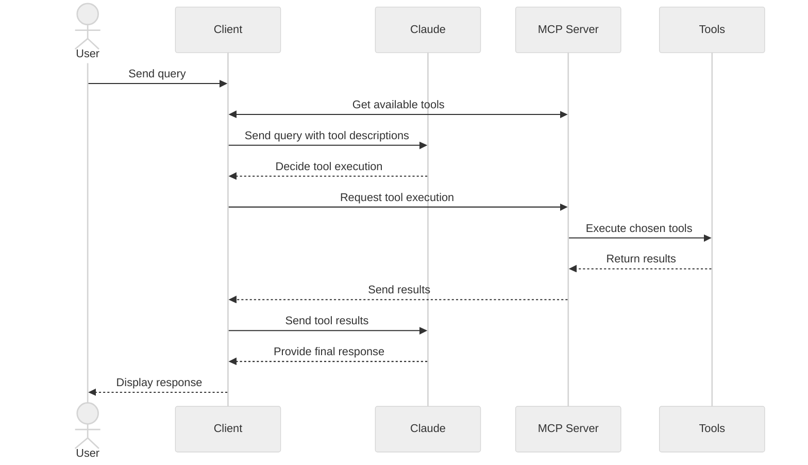

このチュートリアルでは、LLM を活用し、MCP サーバーに接続するチャットボットクライアントの構築方法を学びます。最初のサーバー構築の基本をガイドする [サーバークイックスタート](/quickstart/server) を事前に読んでおくと役立ちます。

<Tabs>
<Tab title="Python">

[このチュートリアルの完全なコードはここから見つかります。](https://github.com/modelcontextprotocol/quickstart-resources/tree/main/mcp-client-python)

## システム要件

開始する前に、システムが以下の要件を満たしていることを確認してください。

- Mac または Windows コンピューター
- 最新バージョンの Python がインストールされている
- 最新バージョンの `uv` がインストールされている

## 環境設定

まず、`uv` を使って新しい Python プロジェクトを作成します。

```bash
# Create project directory
uv init mcp-client
cd mcp-client

# Create virtual environment
uv venv

# Activate virtual environment
# On Windows:
.venv\Scripts\activate
# On Unix or MacOS:
source .venv/bin/activate

# Install required packages
uv add mcp anthropic python-dotenv

# Remove boilerplate files
# On Windows:
del main.py
# On Unix or MacOS:
rm main.py

# Create our main file
touch client.py
```

## APIキーの設定

[Anthropicコンソール](https://console.anthropic.com/settings/keys)からAnthropic APIキーを取得する必要があります。

APIキーを保存するための`.env`ファイルを作成します。

```bash
# Create .env file
touch .env
```

キーを `.env` ファイルに追加します。

```bash
ANTHROPIC_API_KEY=<your key here>
```

`.gitignore` に `.env` を追加します。

```bash
echo ".env" >> .gitignore
```

<Warning>

`ANTHROPIC_API_KEY` を必ず安全に保管してください。

</Warning>

## クライアントの作成

### 基本的なクライアント構造

まず、インポートを設定し、基本的なクライアントクラスを作成しましょう。

```python
import asyncio
from typing import Optional
from contextlib import AsyncExitStack

from mcp import ClientSession, StdioServerParameters
from mcp.client.stdio import stdio_client

from anthropic import Anthropic
from dotenv import load_dotenv

load_dotenv()  # load environment variables from .env

class MCPClient:
    def __init__(self):
        # Initialize session and client objects
        self.session: Optional[ClientSession] = None
        self.exit_stack = AsyncExitStack()
        self.anthropic = Anthropic()
    # methods will go here
```

### サーバー接続管理

次に、MCP サーバーに接続するメソッドを実装します。

```python
async def connect_to_server(self, server_script_path: str):
    """Connect to an MCP server

    Args:
        server_script_path: Path to the server script (.py or .js)
    """
    is_python = server_script_path.endswith('.py')
    is_js = server_script_path.endswith('.js')
    if not (is_python or is_js):
        raise ValueError("Server script must be a .py or .js file")

    command = "python" if is_python else "node"
    server_params = StdioServerParameters(
        command=command,
        args=[server_script_path],
        env=None
    )

    stdio_transport = await self.exit_stack.enter_async_context(stdio_client(server_params))
    self.stdio, self.write = stdio_transport
    self.session = await self.exit_stack.enter_async_context(ClientSession(self.stdio, self.write))

    await self.session.initialize()

    # List available tools
    response = await self.session.list_tools()
    tools = response.tools
    print("\nConnected to server with tools:", [tool.name for tool in tools])
```

### クエリ処理ロジック

クエリ処理とツール呼び出しの処理のためのコア機能を追加しましょう。

```python
async def process_query(self, query: str) -> str:
    """Process a query using Claude and available tools"""
    messages = [
        {
            "role": "user",
            "content": query
        }
    ]

    response = await self.session.list_tools()
    available_tools = [{
        "name": tool.name,
        "description": tool.description,
        "input_schema": tool.inputSchema
    } for tool in response.tools]

    # Initial Claude API call
    response = self.anthropic.messages.create(
        model="claude-3-5-sonnet-20241022",
        max_tokens=1000,
        messages=messages,
        tools=available_tools
    )

    # Process response and handle tool calls
    final_text = []

    assistant_message_content = []
    for content in response.content:
        if content.type == 'text':
            final_text.append(content.text)
            assistant_message_content.append(content)
        elif content.type == 'tool_use':
            tool_name = content.name
            tool_args = content.input

            # Execute tool call
            result = await self.session.call_tool(tool_name, tool_args)
            final_text.append(f"[Calling tool {tool_name} with args {tool_args}]")

            assistant_message_content.append(content)
            messages.append({
                "role": "assistant",
                "content": assistant_message_content
            })
            messages.append({
                "role": "user",
                "content": [
                    {
                        "type": "tool_result",
                        "tool_use_id": content.id,
                        "content": result.content
                    }
                ]
            })

            # Get next response from Claude
            response = self.anthropic.messages.create(
                model="claude-3-5-sonnet-20241022",
                max_tokens=1000,
                messages=messages,
                tools=available_tools
            )

            final_text.append(response.content[0].text)

    return "\n".join(final_text)
```

### インタラクティブチャットインターフェース

次に、チャットループとクリーンアップ機能を追加します。

```python
async def chat_loop(self):
    """Run an interactive chat loop"""
    print("\nMCP Client Started!")
    print("Type your queries or 'quit' to exit.")

    while True:
        try:
            query = input("\nQuery: ").strip()

            if query.lower() == 'quit':
                break

            response = await self.process_query(query)
            print("\n" + response)

        except Exception as e:
            print(f"\nError: {str(e)}")

async def cleanup(self):
    """Clean up resources"""
    await self.exit_stack.aclose()
```

### メインエントリポイント

最後に、メインの実行ロジックを追加します。

```python
async def main():
    if len(sys.argv) < 2:
        print("Usage: python client.py <path_to_server_script>")
        sys.exit(1)

    client = MCPClient()
    try:
        await client.connect_to_server(sys.argv[1])
        await client.chat_loop()
    finally:
        await client.cleanup()

if __name__ == "__main__":
    import sys
    asyncio.run(main())
```

完全な `client.py` ファイルは [こちら](https://gist.github.com/zckly/f3f28ea731e096e53b39b47bf0a2d4b1) にあります。

## 主要コンポーネントの説明

### 1. クライアントの初期化

- `MCPClient` クラスは、セッション管理と API クライアントを使用して初期化します。
- 適切なリソース管理のために `AsyncExitStack` を使用します。
- Claude とのやり取りのために Anthropic クライアントを構成します。

### 2. サーバー接続

- PythonとNode.jsの両方のサーバーをサポート
- サーバースクリプトの種類を検証
- 適切な通信チャネルを設定
- セッションを初期化し、利用可能なツールを一覧表示

### 3. クエリ処理

- 会話のコンテキストを維持する
- Claude の応答とツール呼び出しを処理する
- Claude とツール間のメッセージフローを管理する
- 結果を統合して一貫性のある応答を生成する

### 4. 対話型インターフェース

- シンプルなコマンドラインインターフェースを提供
- ユーザー入力を処理し、応答を表示
- 基本的なエラー処理を含む
- 正常な終了が可能

### 5. リソース管理

- リソースの適切なクリーンアップ
- 接続に関するエラー処理
- 正常なシャットダウン手順

## 一般的なカスタマイズポイント

1. **ツールの処理**

  - 特定のツールタイプを処理するために `process_query()` を修正する
  - ツール呼び出しにカスタムエラー処理を追加する
  - ツール固有のレスポンスフォーマットを実装する

2. **レスポンス処理**

  - ツール結果のフォーマットをカスタマイズする
  - レスポンスのフィルタリングまたは変換を追加する
  - カスタムログを実装する

3. **ユーザーインターフェース**

  - GUIまたはWebインターフェースを追加する
  - リッチコンソール出力を実装する
  - コマンド履歴またはオートコンプリート機能を追加する

## クライアントの実行

MCPサーバーとクライアントを実行するには：

```bash
uv run client.py path/to/server.py # python server
uv run client.py path/to/build/index.js # node server
```

<Note>

サーバーのクイックスタートから天気のチュートリアルを続ける場合、コマンドは次のようになります: `python client.py .../quickstart-resources/weather-server-python/weather.py`

</Note>

クライアントは以下の処理を行います。

1. 指定されたサーバーに接続します。
2. 利用可能なツールの一覧を表示します。
3. 対話型チャットセッションを開始します。以下の操作が可能です。
  - クエリを入力します。
  - ツールの実行状況を確認します。
  - Claude からの応答を受け取ります。

サーバークイックスタートから天気予報サーバーに接続した場合の表示例を以下に示します。

<Frame>
  
</Frame>

## 仕組み

クエリを送信すると、以下の処理が行われます。

1. クライアントはサーバーから利用可能なツールのリストを取得します。
2. クエリはツールの説明とともにClaudeに送信されます。
3. Claudeは使用するツール（ある場合）を決定します。
4. クライアントはサーバーを介して要求されたツール呼び出しを実行します。
5. 結果がClaudeに返されます。
6. Claudeは自然言語で応答を返します。
7. 応答が表示されます。

## ベストプラクティス

1. **エラー処理**

  - ツールの呼び出しは常に try-catch ブロックで囲む
  - わかりやすいエラーメッセージを表示する
  - 接続の問題を適切に処理する

2. **リソース管理**

  - 適切なクリーンアップには `AsyncExitStack` を使用する
  - 完了したら接続を閉じる
  - サーバーの切断を処理する

3. **セキュリティ**

  - API キーは `.env` に安全に保存する
  - サーバーのレスポンスを検証する
  - ツールの権限には注意する

## トラブルシューティング

### サーバーパスの問題

- サーバースクリプトへのパスが正しいことを確認してください。
- 相対パスが機能しない場合は、絶対パスを使用してください。
- Windows ユーザーの場合、パスにはスラッシュ (/) またはエスケープされたバックスラッシュ (\\) を使用してください。
- サーバーファイルの拡張子が正しいことを確認してください (Python の場合は .py、Node.js の場合は .js)。

正しいパスの使用例:

```bash
# Relative path
uv run client.py ./server/weather.py

# Absolute path
uv run client.py /Users/username/projects/mcp-server/weather.py

# Windows path (either format works)
uv run client.py C:/projects/mcp-server/weather.py
uv run client.py C:\\projects\\mcp-server\\weather.py
```

### 応答のタイミング

- 最初の応答が返されるまでに最大30秒かかる場合があります。
- これは正常な動作であり、以下の場合に発生します。
  - サーバーの初期化中
  - Claude によるクエリの処理中
  - ツールの実行中
- 後続の応答は通常、より高速です。
- この最初の待機期間中は、プロセスを中断しないでください。

### よくあるエラーメッセージ

次のメッセージが表示される場合:

- `FileNotFoundError`: サーバーのパスを確認してください。
- `Connection refused`: サーバーが稼働しており、パスが正しいことを確認してください。
- `Tool execute failed`: ツールに必要な環境変数が設定されていることを確認してください。
- `Timeout error`: クライアント設定でタイムアウト値を増やすことを検討してください。

</Tab>

<Tab title="Node">

[このチュートリアルの完全なコードはここから見つかります。](https://github.com/modelcontextprotocol/quickstart-resources/tree/main/mcp-client-typescript)

## システム要件

開始する前に、システムが以下の要件を満たしていることを確認してください。

- Mac または Windows コンピューター
- Node.js 17 以上がインストールされている
- 最新バージョンの `npm` がインストールされている
- Anthropic API キー (Claude)

## 環境の設定

まず、プロジェクトを作成して設定しましょう。

<CodeGroup>

```bash MacOS/Linux
# Create project directory
mkdir mcp-client-typescript
cd mcp-client-typescript

# Initialize npm project
npm init -y

# Install dependencies
npm install @anthropic-ai/sdk @modelcontextprotocol/sdk dotenv

# Install dev dependencies
npm install -D @types/node typescript

# Create source file
touch index.ts
```

```powershell Windows
# Create project directory
md mcp-client-typescript
cd mcp-client-typescript

# Initialize npm project
npm init -y

# Install dependencies
npm install @anthropic-ai/sdk @modelcontextprotocol/sdk dotenv

# Install dev dependencies
npm install -D @types/node typescript

# Create source file
new-item index.ts
```

</CodeGroup>

`package.json` を更新して `type: "module"` とビルド スクリプトを設定します:

```json package.json
{
  "type": "module",
  "scripts": {
    "build": "tsc && chmod 755 build/index.js"
  }
}
```

プロジェクトのルートに `tsconfig.json` を作成します:

```json tsconfig.json
{
  "compilerOptions": {
    "target": "ES2022",
    "module": "Node16",
    "moduleResolution": "Node16",
    "outDir": "./build",
    "rootDir": "./",
    "strict": true,
    "esModuleInterop": true,
    "skipLibCheck": true,
    "forceConsistentCasingInFileNames": true
  },
  "include": ["index.ts"],
  "exclude": ["node_modules"]
}
```

## APIキーの設定

[Anthropicコンソール](https://console.anthropic.com/settings/keys)からAnthropic APIキーを取得する必要があります。

APIキーを保存するための`.env`ファイルを作成します:

```bash
echo "ANTHROPIC_API_KEY=<your key here>" > .env
```

`.gitignore` に `.env` を追加します。

```bash
echo ".env" >> .gitignore
```

<Warning>

`ANTHROPIC_API_KEY` を必ず安全に保管してください。

</Warning>

## クライアントの作成

### 基本的なクライアント構造

まず、インポートを設定し、`index.ts` に基本的なクライアントクラスを作成します。

```typescript
import { Anthropic } from "@anthropic-ai/sdk";
import {
  MessageParam,
  Tool,
} from "@anthropic-ai/sdk/resources/messages/messages.mjs";
import { Client } from "@modelcontextprotocol/sdk/client/index.js";
import { StdioClientTransport } from "@modelcontextprotocol/sdk/client/stdio.js";
import readline from "readline/promises";
import dotenv from "dotenv";

dotenv.config();

const ANTHROPIC_API_KEY = process.env.ANTHROPIC_API_KEY;
if (!ANTHROPIC_API_KEY) {
  throw new Error("ANTHROPIC_API_KEY is not set");
}

class MCPClient {
  private mcp: Client;
  private anthropic: Anthropic;
  private transport: StdioClientTransport | null = null;
  private tools: Tool[] = [];

  constructor() {
    this.anthropic = new Anthropic({
      apiKey: ANTHROPIC_API_KEY,
    });
    this.mcp = new Client({ name: "mcp-client-cli", version: "1.0.0" });
  }
  // methods will go here
}
```

### サーバー接続管理

次に、MCP サーバーに接続するメソッドを実装します:

```typescript
async connectToServer(serverScriptPath: string) {
  try {
    const isJs = serverScriptPath.endsWith(".js");
    const isPy = serverScriptPath.endsWith(".py");
    if (!isJs && !isPy) {
      throw new Error("Server script must be a .js or .py file");
    }
    const command = isPy
      ? process.platform === "win32"
        ? "python"
        : "python3"
      : process.execPath;

    this.transport = new StdioClientTransport({
      command,
      args: [serverScriptPath],
    });
    await this.mcp.connect(this.transport);

    const toolsResult = await this.mcp.listTools();
    this.tools = toolsResult.tools.map((tool) => {
      return {
        name: tool.name,
        description: tool.description,
        input_schema: tool.inputSchema,
      };
    });
    console.log(
      "Connected to server with tools:",
      this.tools.map(({ name }) => name)
    );
  } catch (e) {
    console.log("Failed to connect to MCP server: ", e);
    throw e;
  }
}
```

### クエリ処理ロジック

クエリ処理とツール呼び出しの処理のためのコア機能を追加しましょう。

```typescript
async processQuery(query: string) {
  const messages: MessageParam[] = [
    {
      role: "user",
      content: query,
    },
  ];

  const response = await this.anthropic.messages.create({
    model: "claude-3-5-sonnet-20241022",
    max_tokens: 1000,
    messages,
    tools: this.tools,
  });

  const finalText = [];

  for (const content of response.content) {
    if (content.type === "text") {
      finalText.push(content.text);
    } else if (content.type === "tool_use") {
      const toolName = content.name;
      const toolArgs = content.input as { [x: string]: unknown } | undefined;

      const result = await this.mcp.callTool({
        name: toolName,
        arguments: toolArgs,
      });
      finalText.push(
        `[Calling tool ${toolName} with args ${JSON.stringify(toolArgs)}]`
      );

      messages.push({
        role: "user",
        content: result.content as string,
      });

      const response = await this.anthropic.messages.create({
        model: "claude-3-5-sonnet-20241022",
        max_tokens: 1000,
        messages,
      });

      finalText.push(
        response.content[0].type === "text" ? response.content[0].text : ""
      );
    }
  }

  return finalText.join("\n");
}
```

### インタラクティブチャットインターフェース

次に、チャットループとクリーンアップ機能を追加します:

```typescript
async chatLoop() {
  const rl = readline.createInterface({
    input: process.stdin,
    output: process.stdout,
  });

  try {
    console.log("\nMCP Client Started!");
    console.log("Type your queries or 'quit' to exit.");

    while (true) {
      const message = await rl.question("\nQuery: ");
      if (message.toLowerCase() === "quit") {
        break;
      }
      const response = await this.processQuery(message);
      console.log("\n" + response);
    }
  } finally {
    rl.close();
  }
}

async cleanup() {
  await this.mcp.close();
}
```

### Main Entry Point

Finally, we'll add the main execution logic:

```typescript
async function main() {
  if (process.argv.length < 3) {
    console.log("Usage: node index.ts <path_to_server_script>");
    return;
  }
  const mcpClient = new MCPClient();
  try {
    await mcpClient.connectToServer(process.argv[2]);
    await mcpClient.chatLoop();
  } finally {
    await mcpClient.cleanup();
    process.exit(0);
  }
}

main();
```

## クライアントの実行

MCPサーバーでクライアントを実行するには：

```bash
# Build TypeScript
npm run build

# Run the client
node build/index.js path/to/server.py # python server
node build/index.js path/to/build/index.js # node server
```

<Note>

サーバーのクイックスタートから天気のチュートリアルを続ける場合、コマンドは次のようになります。 `node build/index.js .../quickstart-resources/weather-server-typescript/build/index.js`

</Note>

**クライアントは次のことを行います**

1. 指定されたサーバーに接続します
2. 利用可能なツールを一覧表示します
3. 対話型チャットセッションを開始します。以下の操作が可能です。
    - クエリを入力します
    - ツールの実行状況を確認します
    - Claude からの回答を受け取ります

## 仕組み

クエリを送信すると、以下の処理が行われます。

1. クライアントはサーバーから利用可能なツールのリストを取得します。
2. クエリはツールの説明とともにClaudeに送信されます。
3. Claudeは使用するツール（ある場合）を決定します。
4. クライアントはサーバーを介して要求されたツール呼び出しを実行します。
5. 結果がClaudeに返されます。
6. Claudeは自然言語で応答を返します。
7. 応答が表示されます。

## ベストプラクティス

1. **エラー処理**

    - エラー検出を向上させるために TypeScript の型システムを使用する
    - ツール呼び出しを try-catch ブロックで囲む
    - わかりやすいエラーメッセージを提供する
    - 接続の問題を適切に処理する

2. **セキュリティ**

    - API キーを `.env` に安全に保存する
    - サーバーのレスポンスを検証する
    - ツールの権限には注意する

## トラブルシューティング

### サーバーパスの問題

- サーバースクリプトへのパスが正しいことを確認してください。
- 相対パスが機能しない場合は、絶対パスを使用してください。
- Windows ユーザーの場合、パスにはスラッシュ (/) またはエスケープされたバックスラッシュ (\\) を使用してください。
- サーバーファイルの拡張子が正しいことを確認してください (Node.js の場合は .js、Python の場合は .py)。

正しいパスの使用例:

```bash
# Relative path
node build/index.js ./server/build/index.js

# Absolute path
node build/index.js /Users/username/projects/mcp-server/build/index.js

# Windows path (either format works)
node build/index.js C:/projects/mcp-server/build/index.js
node build/index.js C:\\projects\\mcp-server\\build\\index.js
```

### 応答のタイミング

- 最初の応答が返されるまでに最大30秒かかる場合があります。
- これは正常な動作であり、以下の場合に発生します。
  - サーバーの初期化中
  - Claude によるクエリの処理中
  - ツールの実行中
- 後続の応答は通常、より高速です。
- この最初の待機期間中は、プロセスを中断しないでください。

### よくあるエラーメッセージ

以下のメッセージが表示される場合：

- `Error: Cannot find module`: ビルドフォルダを確認し、TypeScript のコンパイルが成功していることを確認してください。
- `Connection refused`: サーバーが実行中で、パスが正しいことを確認してください。
- `Tool execution failed`: ツールに必要な環境変数が設定されていることを確認してください。
- `ANTHROPIC_API_KEY is not set`: .env ファイルと環境変数を確認してください。
- `TypeError`: ツールの引数に正しい型を使用していることを確認してください。

</Tab>

<Tab title="Java">

<Note>

これは、Spring AI MCP 自動構成とブートスターターをベースにしたクイックスタートデモです。同期および非同期 MCP クライアントを手動で作成する方法については、[Java SDK クライアント](/sdk/java/mcp-client) のドキュメントを参照してください。

</Note>

この例では、Spring AIのModel Context Protocol（MCP）と[Brave Search MCP Server](https://github.com/modelcontextprotocol/servers-archived/tree/main/src/brave-search)を組み合わせた対話型チャットボットの構築方法を説明します。このアプリケーションは、AnthropicのClaude AIモデルを搭載した会話型インターフェースを作成し、Brave Searchを介してインターネット検索を実行できます。これにより、リアルタイムのWebデータとの自然言語によるインタラクションが可能になります。
[このチュートリアルの完全なコードは、こちらでご覧いただけます。](https://github.com/spring-projects/spring-ai-examples/tree/main/model-context-protocol/web-search/brave-chatbot)

## システム要件

開始する前に、システムが以下の要件を満たしていることを確認してください。

- Java 17 以上
- Maven 3.6 以上
- npx パッケージマネージャー
- Anthropic API キー (Claude)
- Brave Search API キー

## 環境設定

1. npx (Node Package eXecute) をインストールします。
まず、[npm](https://docs.npmjs.com/downloading-and-installing-node-js-and-npm) をインストールし、次のコマンドを実行します。

   ```bash
   npm install -g npx
   ```

2. リポジトリをクローンします。

   ```bash
   git clone https://github.com/spring-projects/spring-ai-examples.git
   cd model-context-protocol/brave-chatbot
   ```

3. API キーを設定します。

   ```bash
   export ANTHROPIC_API_KEY='your-anthropic-api-key-here'
   export BRAVE_API_KEY='your-brave-api-key-here'
   ```

4. アプリケーションをビルドします。

   ```bash
   ./mvnw clean install
   ```

5. Maven を使用してアプリケーションを実行します。

   ```bash
   ./mvnw spring-boot:run
   ```

<Warning>

`ANTHROPIC_API_KEY` キーと `BRAVE_API_KEY` キーを安全に保管してください。

</Warning>

## 仕組み

このアプリケーションは、以下のコンポーネントを通じてSpring AIとBrave Search MCPサーバーを統合します。

### MCP クライアント構成

1. pom.xml に必要な依存関係:

```xml
<dependency>
    <groupId>org.springframework.ai</groupId>
    <artifactId>spring-ai-starter-mcp-client</artifactId>
</dependency>
<dependency>
    <groupId>org.springframework.ai</groupId>
    <artifactId>spring-ai-starter-model-anthropic</artifactId>
</dependency>
```

2. アプリケーションのプロパティ (application.yml):

```yml
spring:
  ai:
    mcp:
      client:
        enabled: true
        name: brave-search-client
        version: 1.0.0
        type: SYNC
        request-timeout: 20s
        stdio:
          root-change-notification: true
          servers-configuration: classpath:/mcp-servers-config.json
        toolcallback:
          enabled: true
    anthropic:
      api-key: ${ANTHROPIC_API_KEY}
```

これにより、`spring-ai-starter-mcp-client` が起動し、指定されたサーバー構成に基づいて 1 つ以上の `McpClient` が作成されます。
`spring.ai.mcp.client.toolcallback.enabled=true` プロパティは、すべての MCP ツールを Spring AI ツールとして自動的に登録するツールコールバックメカニズムを有効にします。
デフォルトでは無効になっています。

3. MCP サーバー構成 (`mcp-servers-config.json`):

```json
{
  "mcpServers": {
    "brave-search": {
      "command": "npx",
      "args": ["-y", "@modelcontextprotocol/server-brave-search"],
      "env": {
        "BRAVE_API_KEY": "<PUT YOUR BRAVE API KEY>"
      }
    }
  }
}
```

### チャットの実装

チャットボットは、Spring AI の ChatClient と MCP ツールの統合を使用して実装されています。

```java
var chatClient = chatClientBuilder
    .defaultSystem("You are useful assistant, expert in AI and Java.")
    .defaultToolCallbacks((Object[]) mcpToolAdapter.toolCallbacks())
    .defaultAdvisors(new MessageChatMemoryAdvisor(new InMemoryChatMemory()))
    .build();
```

<Warning>

重大な変更: SpringAI 1.0.0-M8 以降では、MCP ツールを登録するには `.defaultTool(...)` ではなく `.defaultToolCallbacks(...)` を使用します。

</Warning>

主な機能：

- 自然言語理解にClaude AIモデルを使用
- MCPを介してBrave Searchを統合し、リアルタイムウェブ検索機能を実現
- InMemoryChatMemoryを使用して会話のメモリを維持
- インタラクティブなコマンドラインアプリケーションとして実行

### ビルドして実行

```bash
./mvnw clean install
java -jar ./target/ai-mcp-brave-chatbot-0.0.1-SNAPSHOT.jar
```

or

```bash
./mvnw spring-boot:run
```

アプリケーションは、ユーザーが質問できるインタラクティブなチャットセッションを開始します。チャットボットは、ユーザーの質問に答えるためにインターネットから情報を検索する必要がある場合、Brave Search を使用します。

チャットボットは以下の機能を提供します。

- 内蔵の知識を使って質問に答える
- 必要に応じて Brave Search を使用してウェブ検索を実行する
- 会話中の以前のメッセージのコンテキストを記憶する
- 複数の情報源からの情報を組み合わせて、包括的な回答を提供する

### 高度な設定

MCPクライアントは、以下の追加設定オプションをサポートしています。

- `McpSyncClientCustomizer` または `McpAsyncClientCustomizer` によるクライアントのカスタマイズ
- 複数のトランスポートタイプ（`STDIO` および `SSE` (Server-Sent Events)）を備えた複数のクライアント
- Spring AI のツール実行フレームワークとの統合
- クライアントの自動初期化とライフサイクル管理

WebFluxベースのアプリケーションの場合は、代わりにWebFluxスターターを使用できます。

```xml
<dependency>
    <groupId>org.springframework.ai</groupId>
    <artifactId>spring-ai-mcp-client-webflux-spring-boot-starter</artifactId>
</dependency>
```

これは同様の機能を提供しますが、WebFlux ベースの SSE トランスポート実装を使用するため、本番環境のデプロイメントに推奨されます。

</Tab>

<Tab title="Kotlin">

[このチュートリアルの完全なコードはここから見つかります。](https://github.com/modelcontextprotocol/kotlin-sdk/tree/main/samples/kotlin-mcp-client)

## システム要件

開始する前に、システムが以下の要件を満たしていることを確認してください。

- Java 17 以上
- Anthropic API キー (Claude)

## 環境設定

まず、`java` と `gradle` をまだインストールしていない場合はインストールしましょう。
`java` は [公式 Oracle JDK ウェブサイト](https://www.oracle.com/java/technologies/downloads/) からダウンロードできます。
`java` のインストールを確認します。

```bash
java --version
```

それでは、プロジェクトを作成して設定しましょう。

<CodeGroup>

```bash MacOS/Linux
# Create a new directory for our project
mkdir kotlin-mcp-client
cd kotlin-mcp-client

# Initialize a new kotlin project
gradle init
```

```powershell Windows
# Create a new directory for our project
md kotlin-mcp-client
cd kotlin-mcp-client
# Initialize a new kotlin project
gradle init
```

</CodeGroup>

`gradle init` を実行すると、プロジェクト作成のオプションが表示されます。
プロジェクトタイプとして **Application**、プログラミング言語として **Kotlin**、Java バージョンとして **Java 17** を選択します。

または、[IntelliJ IDEA プロジェクトウィザード](https://kotlinlang.org/docs/jvm-get-started.html) を使用して Kotlin アプリケーションを作成することもできます。

プロジェクトを作成したら、次の依存関係を追加します。

<CodeGroup>

```kotlin build.gradle.kts
val mcpVersion = "0.4.0"
val slf4jVersion = "2.0.9"
val anthropicVersion = "0.8.0"

dependencies {
    implementation("io.modelcontextprotocol:kotlin-sdk:$mcpVersion")
    implementation("org.slf4j:slf4j-nop:$slf4jVersion")
    implementation("com.anthropic:anthropic-java:$anthropicVersion")
}
```

```groovy build.gradle
def mcpVersion = '0.3.0'
def slf4jVersion = '2.0.9'
def anthropicVersion = '0.8.0'
dependencies {
    implementation "io.modelcontextprotocol:kotlin-sdk:$mcpVersion"
    implementation "org.slf4j:slf4j-nop:$slf4jVersion"
    implementation "com.anthropic:anthropic-java:$anthropicVersion"
}
```

</CodeGroup>

また、ビルド スクリプトに次のプラグインを追加します。

<CodeGroup>

```kotlin build.gradle.kts
plugins {
    id("com.github.johnrengelman.shadow") version "8.1.1"
}
```

```groovy build.gradle
plugins {
    id 'com.github.johnrengelman.shadow' version '8.1.1'
}
```

</CodeGroup>

## APIキーの設定

[Anthropicコンソール](https://console.anthropic.com/settings/keys)からAnthropic APIキーを取得する必要があります。

APIキーの設定:

```bash
export ANTHROPIC_API_KEY='your-anthropic-api-key-here'
```

<Warning>

`ANTHROPIC_API_KEY` を安全に保管してください。

</Warning>

## クライアントの作成

### 基本的なクライアント構造

まず、基本的なクライアントクラスを作成しましょう。

```kotlin
class MCPClient : AutoCloseable {
    private val anthropic = AnthropicOkHttpClient.fromEnv()
    private val mcp: Client = Client(clientInfo = Implementation(name = "mcp-client-cli", version = "1.0.0"))
    private lateinit var tools: List<ToolUnion>

    // methods will go here

    override fun close() {
        runBlocking {
            mcp.close()
            anthropic.close()
        }
    }
```

### サーバー接続管理

次に、MCPサーバーに接続するメソッドを実装します。

```kotlin
suspend fun connectToServer(serverScriptPath: String) {
    try {
        val command = buildList {
            when (serverScriptPath.substringAfterLast(".")) {
                "js" -> add("node")
                "py" -> add(if (System.getProperty("os.name").lowercase().contains("win")) "python" else "python3")
                "jar" -> addAll(listOf("java", "-jar"))
                else -> throw IllegalArgumentException("Server script must be a .js, .py or .jar file")
            }
            add(serverScriptPath)
        }

        val process = ProcessBuilder(command).start()
        val transport = StdioClientTransport(
            input = process.inputStream.asSource().buffered(),
            output = process.outputStream.asSink().buffered()
        )

        mcp.connect(transport)

        val toolsResult = mcp.listTools()
        tools = toolsResult?.tools?.map { tool ->
            ToolUnion.ofTool(
                Tool.builder()
                    .name(tool.name)
                    .description(tool.description ?: "")
                    .inputSchema(
                        Tool.InputSchema.builder()
                            .type(JsonValue.from(tool.inputSchema.type))
                            .properties(tool.inputSchema.properties.toJsonValue())
                            .putAdditionalProperty("required", JsonValue.from(tool.inputSchema.required))
                            .build()
                    )
                    .build()
            )
        } ?: emptyList()
        println("Connected to server with tools: ${tools.joinToString(", ") { it.tool().get().name() }}")
    } catch (e: Exception) {
        println("Failed to connect to MCP server: $e")
        throw e
    }
}
```

また、Anthropic の `JsonObject` から `JsonValue` に変換するヘルパー関数も作成します。

```kotlin
private fun JsonObject.toJsonValue(): JsonValue {
    val mapper = ObjectMapper()
    val node = mapper.readTree(this.toString())
    return JsonValue.fromJsonNode(node)
}
```

### クエリ処理ロジック

クエリ処理とツール呼び出しの処理のためのコア機能を追加しましょう。

```kotlin
private val messageParamsBuilder: MessageCreateParams.Builder = MessageCreateParams.builder()
    .model(Model.CLAUDE_3_5_SONNET_20241022)
    .maxTokens(1024)

suspend fun processQuery(query: String): String {
    val messages = mutableListOf(
        MessageParam.builder()
            .role(MessageParam.Role.USER)
            .content(query)
            .build()
    )

    val response = anthropic.messages().create(
        messageParamsBuilder
            .messages(messages)
            .tools(tools)
            .build()
    )

    val finalText = mutableListOf<String>()
    response.content().forEach { content ->
        when {
            content.isText() -> finalText.add(content.text().getOrNull()?.text() ?: "")

            content.isToolUse() -> {
                val toolName = content.toolUse().get().name()
                val toolArgs =
                    content.toolUse().get()._input().convert(object : TypeReference<Map<String, JsonValue>>() {})

                val result = mcp.callTool(
                    name = toolName,
                    arguments = toolArgs ?: emptyMap()
                )
                finalText.add("[Calling tool $toolName with args $toolArgs]")

                messages.add(
                    MessageParam.builder()
                        .role(MessageParam.Role.USER)
                        .content(
                            """
                                "type": "tool_result",
                                "tool_name": $toolName,
                                "result": ${result?.content?.joinToString("\n") { (it as TextContent).text ?: "" }}
                            """.trimIndent()
                        )
                        .build()
                )

                val aiResponse = anthropic.messages().create(
                    messageParamsBuilder
                        .messages(messages)
                        .build()
                )

                finalText.add(aiResponse.content().first().text().getOrNull()?.text() ?: "")
            }
        }
    }

    return finalText.joinToString("\n", prefix = "", postfix = "")
}
```

### インタラクティブチャット

チャットループを追加します。

```kotlin
suspend fun chatLoop() {
    println("\nMCP Client Started!")
    println("Type your queries or 'quit' to exit.")

    while (true) {
        print("\nQuery: ")
        val message = readLine() ?: break
        if (message.lowercase() == "quit") break
        val response = processQuery(message)
        println("\n$response")
    }
}
```

### メインエントリポイント

最後に、メイン実行関数を追加します。

```kotlin
fun main(args: Array<String>) = runBlocking {
    if (args.isEmpty()) throw IllegalArgumentException("Usage: java -jar <your_path>/build/libs/kotlin-mcp-client-0.1.0-all.jar <path_to_server_script>")
    val serverPath = args.first()
    val client = MCPClient()
    client.use {
        client.connectToServer(serverPath)
        client.chatLoop()
    }
}
```

## クライアントの実行

MCPサーバーでクライアントを実行するには：

```bash
./gradlew build

# Run the client
java -jar build/libs/<your-jar-name>.jar path/to/server.jar # jvm server
java -jar build/libs/<your-jar-name>.jar path/to/server.py # python server
java -jar build/libs/<your-jar-name>.jar path/to/build/index.js # node server
```

<Note>

サーバーのクイックスタートから天気のチュートリアルを続ける場合、コマンドは次のようになります: `java -jar build/libs/kotlin-mcp-client-0.1.0-all.jar .../samples/weather-stdio-server/build/libs/weather-stdio-server-0.1.0-all.jar`

</Note>

**クライアントは次のことを行います**

1. 指定されたサーバーに接続します
2. 利用可能なツールを一覧表示します
3. 対話型チャットセッションを開始します。以下の操作が可能です。
    - クエリを入力します
    - ツールの実行状況を確認します
    - Claude からの回答を受け取ります

## 仕組み

ワークフローの大まかなスキーマは次のとおりです:



クエリを送信すると、以下の処理が行われます:

1. クライアントはサーバーから利用可能なツールのリストを取得します。
2. クエリはツールの説明とともにClaudeに送信されます。
3. Claudeは使用するツール（ある場合）を決定します。
4. クライアントは、要求されたツール呼び出しをサーバー経由で実行します。
5. 結果がClaudeに返されます。
6. Claudeは自然言語で応答します。
7. 応答が表示されます。

## ベストプラクティス

1. **エラー処理**

    - Kotlin の型システムを活用してエラーを明示的にモデル化する
    - 例外が発生する可能性がある場合は、外部ツールと API 呼び出しを `try-catch` ブロックで囲む
    - 明確でわかりやすいエラーメッセージを提供する
    - ネットワークのタイムアウトや接続の問題を適切に処理する

2. **セキュリティ**

    - API キーとシークレットを `local.properties`、環境変数、またはシークレットマネージャーに安全に保存する
    - 予期しないデータや安全でないデータの使用を回避するため、すべての外部レスポンスを検証する
    - ツールを使用する際は、権限と信頼境界に注意する

## トラブルシューティング

### サーバーパスの問題

- サーバースクリプトへのパスが正しいことを確認してください。
- 相対パスが機能しない場合は、絶対パスを使用してください。
- Windows ユーザーの場合、パスにはスラッシュ (/) またはエスケープされたバックスラッシュ (\\) を使用してください。
- 必要なランタイムがインストールされていることを確認してください (Java の場合は java、Node.js の場合は npm、Python の場合は uv)。
- サーバーファイルの拡張子が正しいことを確認してください (Java の場合は .jar、Node.js の場合は .js、Python の場合は .py)。

正しいパスの使用例:

```bash
# Relative path
java -jar build/libs/client.jar ./server/build/libs/server.jar

# Absolute path
java -jar build/libs/client.jar /Users/username/projects/mcp-server/build/libs/server.jar

# Windows path (either format works)
java -jar build/libs/client.jar C:/projects/mcp-server/build/libs/server.jar
java -jar build/libs/client.jar C:\\projects\\mcp-server\\build\\libs\\server.jar
```

### 応答のタイミング

- 最初の応答が返されるまでに最大30秒かかる場合があります。
- これは正常な動作であり、以下の場合に発生します。
  - サーバーの初期化中
  - Claude によるクエリの処理中
  - ツールの実行中
- 後続の応答は通常、より高速です。
- この最初の待機期間中は、プロセスを中断しないでください。

### よくあるエラーメッセージ

以下のメッセージが表示される場合:

- 「接続が拒否されました」: サーバーが稼働しており、パスが正しいことを確認してください。
- 「ツールの実行に失敗しました」: ツールに必要な環境変数が設定されていることを確認してください。
- 「ANTHROPIC_API_KEY が設定されていません」: 環境変数を確認してください。

</Tab>

<Tab title="C#">

[このチュートリアルの完全なコードはここから見つかります。](https://github.com/modelcontextprotocol/csharp-sdk/tree/main/samples/QuickstartClient)

## システム要件

開始する前に、システムが以下の要件を満たしていることを確認してください。

- .NET 8.0 以上
- Anthropic API キー (Claude)
- Windows、Linux、または MacOS

## 環境の設定

まず、新しい .NET プロジェクトを作成します。

```bash
dotnet new console -n QuickstartClient
cd QuickstartClient
```

次に、必要な依存関係をプロジェクトに追加します。

```bash
dotnet add package ModelContextProtocol --prerelease
dotnet add package Anthropic.SDK
dotnet add package Microsoft.Extensions.Hosting
dotnet add package Microsoft.Extensions.AI
```

## APIキーの設定

[Anthropicコンソール](https://console.anthropic.com/settings/keys)からAnthropic APIキーを取得する必要があります。

```bash
dotnet user-secrets init
dotnet user-secrets set "ANTHROPIC_API_KEY" "<your key here>"
```

## クライアントの作成

### 基本的なクライアント構造

まず、`Program.cs` ファイルに基本的なクライアントクラスを設定します。

```csharp
using Anthropic.SDK;
using Microsoft.Extensions.AI;
using Microsoft.Extensions.Configuration;
using Microsoft.Extensions.Hosting;
using ModelContextProtocol.Client;
using ModelContextProtocol.Protocol.Transport;

var builder = Host.CreateApplicationBuilder(args);

builder.Configuration
    .AddEnvironmentVariables()
    .AddUserSecrets<Program>();
```

これにより、ユーザーシークレットからAPIキーを読み取ることができる.NETコンソールアプリケーションの基礎が作成されます。

次に、MCPクライアントをセットアップします。

```csharp
var (command, arguments) = GetCommandAndArguments(args);

var clientTransport = new StdioClientTransport(new()
{
    Name = "Demo Server",
    Command = command,
    Arguments = arguments,
});

await using var mcpClient = await McpClientFactory.CreateAsync(clientTransport);

var tools = await mcpClient.ListToolsAsync();
foreach (var tool in tools)
{
    Console.WriteLine($"Connected to server with tools: {tool.Name}");
}
```

この関数を `Program.cs` ファイルの最後に追加します。

```csharp
static (string command, string[] arguments) GetCommandAndArguments(string[] args)
{
    return args switch
    {
        [var script] when script.EndsWith(".py") => ("python", args),
        [var script] when script.EndsWith(".js") => ("node", args),
        [var script] when Directory.Exists(script) || (File.Exists(script) && script.EndsWith(".csproj")) => ("dotnet", ["run", "--project", script, "--no-build"]),
        _ => throw new NotSupportedException("An unsupported server script was provided. Supported scripts are .py, .js, or .csproj")
    };
}
```

これにより、コマンドライン引数として指定されたサーバーに接続するMCPクライアントが作成されます。接続されたサーバーで利用可能なツールの一覧が表示されます。

### クエリ処理ロジック

クエリ処理とツール呼び出しの処理のためのコア機能を追加しましょう。

```csharp
using var anthropicClient = new AnthropicClient(new APIAuthentication(builder.Configuration["ANTHROPIC_API_KEY"]))
    .Messages
    .AsBuilder()
    .UseFunctionInvocation()
    .Build();

var options = new ChatOptions
{
    MaxOutputTokens = 1000,
    ModelId = "claude-3-5-sonnet-20241022",
    Tools = [.. tools]
};

Console.ForegroundColor = ConsoleColor.Green;
Console.WriteLine("MCP Client Started!");
Console.ResetColor();

PromptForInput();
while(Console.ReadLine() is string query && !"exit".Equals(query, StringComparison.OrdinalIgnoreCase))
{
    if (string.IsNullOrWhiteSpace(query))
    {
        PromptForInput();
        continue;
    }

    await foreach (var message in anthropicClient.GetStreamingResponseAsync(query, options))
    {
        Console.Write(message);
    }
    Console.WriteLine();

    PromptForInput();
}

static void PromptForInput()
{
    Console.WriteLine("Enter a command (or 'exit' to quit):");
    Console.ForegroundColor = ConsoleColor.Cyan;
    Console.Write("> ");
    Console.ResetColor();
}
```

## 主要コンポーネントの説明

### 1. クライアントの初期化

- クライアントは `McpClientFactory.CreateAsync()` を使用して初期化されます。この関数は、サーバーを実行するためのトランスポートタイプとコマンドを設定します。

### 2. サーバー接続

- Python、Node.js、.NET サーバーをサポートします。
- 引数で指定されたコマンドを使用してサーバーを起動します。
- サーバーとの通信に stdio を使用するように設定します。
- セッションと利用可能なツールを初期化します。

### 3. クエリ処理

- チャットクライアントに [Microsoft.Extensions.AI](https://learn.microsoft.com/dotnet/ai/ai-extensions) を活用します。
- 自動ツール（関数）呼び出しを使用するように `IChatClient` を構成します。
- クライアントはユーザー入力を読み取り、サーバーに送信します。
- サーバーはクエリを処理し、応答を返します。
- 応答はユーザーに表示されます。

## クライアントの実行

MCPサーバーでクライアントを実行するには：

```bash
dotnet run -- path/to/server.csproj # dotnet server
dotnet run -- path/to/server.py # python server
dotnet run -- path/to/server.js # node server
```

<Note>

サーバーのクイックスタートから天気のチュートリアルを続ける場合、コマンドは次のようになります。 `dotnet run -- path/to/QuickstartWeatherServer`.

</Note>

クライアントは以下の処理を行います。

1. 指定されたサーバーに接続します。
2. 利用可能なツールの一覧を表示します。
3. 対話型チャットセッションを開始します。以下の操作が可能です。
  - クエリを入力します。
  - ツールの実行状況を確認します。
  - Claude からの応答を受け取ります。
4. 完了したらセッションを終了します。

天気予報サーバーのクイックスタートに接続した場合の表示例を以下に示します。

<Frame>
  
</Frame>

</Tab>

</Tabs>

## Next steps

<CardGroup cols={2}>
  <Card title="Example servers" icon="grid" href="/examples">
    Check out our gallery of official MCP servers and implementations
  </Card>
  <Card title="Clients" icon="cubes" href="/clients">
    View the list of clients that support MCP integrations
  </Card>
  <Card
    title="Building MCP with LLMs"
    icon="comments"
    href="/tutorials/building-mcp-with-llms"
  >
    Learn how to use LLMs like Claude to speed up your MCP development
  </Card>
  <Card
    title="Core architecture"
    icon="sitemap"
    href="/legacy/concepts/architecture"
  >
    Understand how MCP connects clients, servers, and LLMs
  </Card>
</CardGroup>
