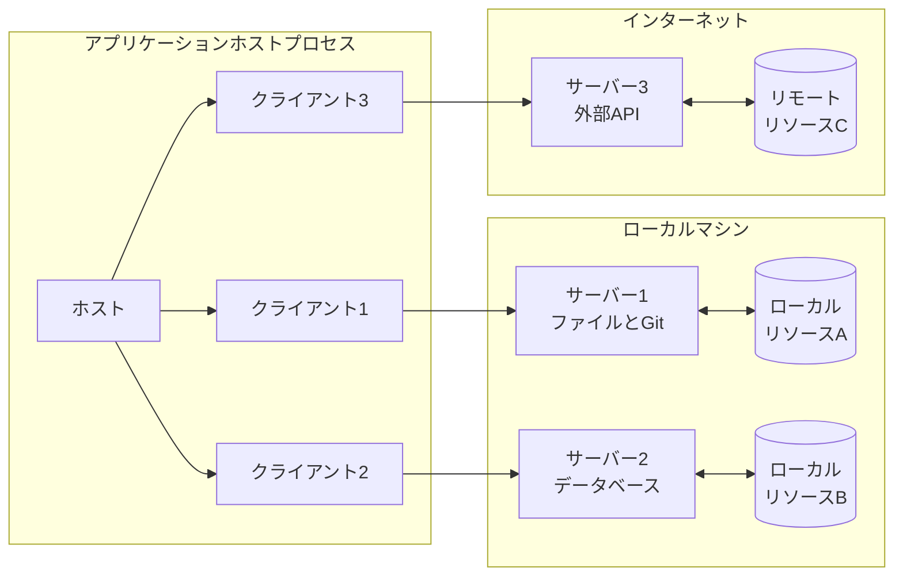

<div id="enable-section-numbers" />

モデルコンテキストプロトコル（MCP）は、各ホストが複数のクライアントインスタンスを実行できるクライアント・ホスト・サーバーアーキテクチャを採用しています。
このアーキテクチャにより、ユーザーは明確なセキュリティ境界を維持し、懸念事項を分離しながら、アプリケーション間でAI機能を統合できます。
JSON-RPCを基盤とするMCPは、クライアントとサーバー間のコンテキスト交換とサンプリング調整に重点を置いたステートフルなセッションプロトコルを提供します。

## コアコンポーネント



### ホスト

ホストプロセスはコンテナおよびコーディネーターとして機能します。

- 複数のクライアントインスタンスを作成および管理します。
- クライアント接続の権限とライフサイクルを制御します。
- セキュリティポリシーと同意要件を適用します。
- ユーザー認証の決定を処理します。
- AI/LLM の統合とサンプリングを調整します。
- クライアント間のコンテキスト集約を管理します。

### クライアント

各クライアントはホストによって作成され、独立したサーバー接続を維持します。

- サーバーごとに1つのステートフルセッションを確立します。
- プロトコルネゴシエーションと機能交換を処理します。
- プロトコルメッセージを双方向にルーティングします。
- サブスクリプションと通知を管理します。
- サーバー間のセキュリティ境界を維持します。

ホストアプリケーションは複数のクライアントを作成および管理し、各クライアントは特定のサーバーと1対1の関係を持ちます。

### サーバー

サーバーは、以下の特殊なコンテキストと機能を提供します。

- MCPプリミティブを介してリソース、ツール、プロンプトを公開する
- 特定の責任において独立して動作する
- クライアントインターフェースを介してサンプリングを要求する
- セキュリティ制約を遵守する必要がある
- ローカルプロセスまたはリモートサービスとして利用可能

## 設計原則

MCPは、そのアーキテクチャと実装を規定するいくつかの重要な設計原則に基づいて構築されています。

1. **サーバーは極めて容易に構築できるべき**

  - ホストアプリケーションは複雑なオーケストレーションの責任を担う
  - サーバーは明確に定義された特定の機能に特化する
  - シンプルなインターフェースは実装オーバーヘッドを最小限に抑える
  - 明確な分離により、保守性の高いコードを実現する

2. **サーバーは高度にコンポーザブルであるべき**

  - 各サーバーは、それぞれ独立した特定の機能を提供する
  - 複数のサーバーをシームレスに組み合わせることができる
  - 共有プロトコルは相互運用性を実現する
  - モジュール設計は拡張性をサポートする

3. **サーバーは会話全体を読み取り、他のサーバーを「覗き見る」ことができないべき**

  - サーバーは必要なコンテキスト情報のみを受信する
  - 完全な会話履歴はホストに保持される
  - 各サーバー接続は独立性を維持する
  - サーバー間のやり取りはホストによって制御される
  - ホストプロセスはセキュリティ境界を強制する

4. **サーバーとクライアントに段階的に機能を追加できる**

  - コアプロトコルは必要最小限の機能を提供する
  - 必要に応じて追加機能をネゴシエートできる
  - サーバーとクライアントは独立して進化します
  - 将来の拡張性を考慮して設計されたプロトコル
  - 下位互換性が維持されます

## 機能ネゴシエーション

モデルコンテキストプロトコルは、クライアントとサーバーが初期化時にサポートする機能を明示的に宣言する、機能ベースのネゴシエーションシステムを採用しています。
機能によって、セッション中に利用可能なプロトコル機能とプリミティブが決まります。

- サーバーは、リソースサブスクリプション、ツールサポート、プロンプトテンプレートなどの機能を宣言します。
- クライアントは、サンプリングサポートや通知処理などの機能を宣言します。
- 両当事者は、セッション全体を通して宣言された機能を尊重する必要があります。
- プロトコルの拡張を通じて、追加の機能をネゴシエートできます。

```mermaid
sequenceDiagram
    participant ホスト
    participant クライアント
    participant サーバー

    ホスト->>+クライアント: クライアントを初期化する
    クライアント->>+サーバー: 機能を使用してセッションを初期化する
    サーバー-->>クライアント: サポートされている機能で応答する

    Note over ホスト,サーバー: ネゴシエートされた機能によるアクティブセッション

    loop クライアント Requests
        ホスト->>クライアント: ユーザーまたはモデルが開始したアクション
        クライアント->>サーバー: リクエスト（ツール/リソース）
        サーバー-->>クライアント: レスポンス
        クライアント-->>ホスト: UIを更新したりモデルに応答したりする
    end

    loop サーバー Requests
        サーバー->>クライアント: リクエスト（サンプリング）
        クライアント->>ホスト: AI に転送
        ホスト-->>クライアント: AI の応答
        クライアント-->>サーバー: レスポンス
    end

    loop Notifications
        サーバー--)クライアント: リソースの更新
        クライアント--)サーバー: ステータスの変更
    end

    ホスト->>クライアント: 終了
    クライアント->>-サーバー: セッション終了
    サーバーを非アクティブ化する
```

各機能は、セッション中に使用できる特定のプロトコル機能をロック解除します。例：

- 実装された [サーバー機能](/specification/2025-06-18/server) は、サーバーの機能でアドバタイズする必要があります。
- リソースサブスクリプション通知を発行するには、サーバーがサブスクリプションのサポートを宣言する必要があります。
- ツールを呼び出すには、サーバーがツールの機能を宣言する必要があります。
- [サンプリング](/specification/2025-06-18/client) は、クライアントが機能でサポートを宣言する必要があります。

この機能ネゴシエーションにより、クライアントとサーバーはプロトコルの拡張性を維持しながら、サポートされている機能を明確に理解できます。
