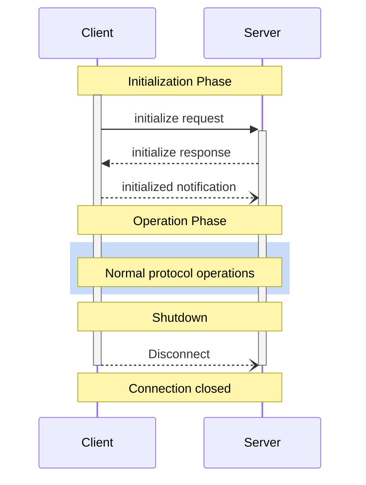

<div id="enable-section-numbers" />

<Info>**Protocol Revision**: 2025-06-18</Info>

モデルコンテキストプロトコル (MCP) は、クライアントサーバー接続の厳格なライフサイクルを定義し、適切な機能ネゴシエーションと状態管理を保証します。

1. **初期化**: 機能ネゴシエーションとプロトコルバージョンの合意
2. **操作**: 通常のプロトコル通信
3. **シャットダウン**: 接続の正常な終了



## ライフサイクルフェーズ

### 初期化

初期化フェーズは、クライアントとサーバー間の最初のやり取りでなければなりません。

このフェーズでは、クライアントとサーバーは以下の処理を行います。

- プロトコルバージョンの互換性を確立する
- 機能の交換とネゴシエーションを行う
- 実装の詳細を共有する

クライアントは、以下の情報を含む「initialize」リクエストを送信することにより、このフェーズを開始しなければなりません。

- サポートされているプロトコルバージョン
- クライアントの機能
- クライアントの実装情報

```json
{
  "jsonrpc": "2.0",
  "id": 1,
  "method": "initialize",
  "params": {
    "protocolVersion": "2024-11-05",
    "capabilities": {
      "roots": {
        "listChanged": true
      },
      "sampling": {},
      "elicitation": {}
    },
    "clientInfo": {
      "name": "ExampleClient",
      "title": "Example Client Display Name",
      "version": "1.0.0"
    }
  }
}
```

サーバーは**自身の機能と情報で応答しなければなりません**:

```json
{
  "jsonrpc": "2.0",
  "id": 1,
  "result": {
    "protocolVersion": "2024-11-05",
    "capabilities": {
      "logging": {},
      "prompts": {
        "listChanged": true
      },
      "resources": {
        "subscribe": true,
        "listChanged": true
      },
      "tools": {
        "listChanged": true
      }
    },
    "serverInfo": {
      "name": "ExampleServer",
      "title": "Example Server Display Name",
      "version": "1.0.0"
    },
    "instructions": "Optional instructions for the client"
  }
}
```

初期化が成功した後、クライアントは通常の操作を開始する準備ができていることを示すために「初期化済み」通知を送信する必要があります。

```json
{
  "jsonrpc": "2.0",
  "method": "notifications/initialized"
}
```

- サーバーが `initialize` リクエストに応答する前に、クライアントは [ping](/specification/2025-06-18/basic/utilities/ping) 以外のリクエストを送信すべきではありません。****
- サーバーは、`initialized` 通知を受信する前に、[ping](/specification/2025-06-18/basic/utilities/ping) と
[logging](/specification/2025-06-18/server/utilities/logging) 以外のリクエストを送信すべきではありません。**すべきではありません**。

#### バージョンネゴシエーション

`initialize` リクエストにおいて、クライアントはサポートするプロトコルバージョンを送信する必要があります。

このバージョンは、クライアントがサポートする最新バージョンである必要があります。

サーバーが要求されたプロトコルバージョンをサポートしている場合、同じバージョンで応答する必要があります。
そうでない場合、サーバーはサポートする別のプロトコルバージョンで応答する必要があります。
このバージョンは、サーバーがサポートする最新バージョンである必要があります。

クライアントがサーバーの応答でサポートしていないバージョンをサポートしている場合、接続を切断する必要があります。

<Note>
HTTP を使用する場合、クライアントは MCP サーバーへの後続のすべてのリクエストに `MCP-Protocol-Version: <protocol-version>` HTTP ヘッダーを含める必要があります (**MUST**)。詳細については、[トランスポートのプロトコル バージョン ヘッダー セクション](/specification/2025-06-18/basic/transports#protocol-version-header) を参照してください。
</Note>

#### 機能ネゴシエーション

クライアントとサーバーの機能により、セッション中に利用可能なオプションのプロトコル機能が決定されます。

主な機能は次のとおりです。

| Category | Capability     | Description                                                                               |
| -------- | -------------- | ----------------------------------------------------------------------------------------- |
| Client   | `roots`        | ファイルシステム[roots](/specification/2025-06-18/client/roots)を提供する機能|
| Client   | `sampling`     | LLM [サンプリング](/specification/2025-06-18/client/sampling)リクエストのサポート|
| Client   | `elicitation`  | サーバーの[elicitation](/specification/2025-06-18/client/elicitation)リクエストのサポート|
| Client   | `experimental` | 非標準の実験的機能のサポートについて説明します|
| Server   | `prompts`      | [プロンプトテンプレート](/specification/2025-06-18/server/prompts)を提供します|
| Server   | `resources`    | 読み取り可能な[リソース](/specification/2025-06-18/server/resources)を提供します|
| Server   | `tools`        | 呼び出し可能な[ツール](/specification/2025-06-18/server/tools)を公開します|
| Server   | `logging`      | 構造化された[ログメッセージ](/specification/2025-06-18/server/utilities/logging)を出力します。|
| Server   | `completions`  | 引数の[自動補完](/specification/2025-06-18/server/utilities/completion)をサポートします|
| Server   | `experimental` | 非標準の実験的機能のサポートについて説明します|

機能オブジェクトは、次のようなサブ機能を記述できます。

- `listChanged`: リストの変更通知のサポート（プロンプト、リソース、ツール用）
- `subscribe`: 個々のアイテムの変更を購読するサポート（リソースのみ）

### オペレーション

オペレーションフェーズでは、クライアントとサーバーはネゴシエートされた機能に基づいてメッセージを交換します。

双方は**必須**です。

- ネゴシエートされたプロトコルバージョンを尊重する
- ネゴシエートに成功した機能のみを使用する

### シャットダウン

シャットダウンフェーズでは、一方（通常はクライアント）がプロトコル接続を正常に終了します。
特定のシャットダウンメッセージは定義されていません。代わりに、基盤となるトランスポートメカニズムを使用して接続終了を通知する必要があります。

#### stdio

stdio [トランスポート](/specification/2025-06-18/basic/transports)の場合、クライアントは以下の方法でシャットダウンを開始すべきです。

1. まず、子プロセス（サーバー）への入力ストリームを閉じる。
2. サーバーが終了するのを待つ。サーバーが適切な時間内に終了しない場合は、`SIGTERM` を送信する。
3. `SIGTERM` 送信後、適切な時間内にサーバーが終了しない場合は、`SIGKILL` を送信する。

サーバーは、クライアントへの出力ストリームを閉じて終了することでシャットダウンを開始してもよい（MAY）*。

#### HTTP

HTTP [トランスポート](/specification/2025-06-18/basic/transports) の場合、シャットダウンは関連する HTTP 接続を閉じることによって示されます。

## タイムアウト

実装は、接続のハングやリソース枯渇を防ぐため、送信されたすべてのリクエストにタイムアウトを設定する必要があります（SHOULD）**。

リクエストがタイムアウト期間内に成功またはエラーのレスポンスを受信しなかった場合、送信者はそのリクエストに対して[キャンセル通知](/specification/2025-06-18/basic/utilities/cancellation)を発行し、レスポンスの待機を停止する必要があります（SHOULD）**。

SDKやその他のミドルウェアは、これらのタイムアウトをリクエストごとに設定できるようにする必要があります（SHOULD）**。

実装は、リクエストに対応する[進行状況通知](/specification/2025-06-18/basic/utilities/progress)を受信した場合、実際に作業が行われていることを示すため、タイムアウトクロックをリセットすることを選択できます（MAY）**。
ただし、クライアントまたはサーバーの不正な動作による影響を制限するため、実装は進行状況通知の有無にかかわらず、常に最大タイムアウトを強制する必要があります（SHOULD）**。

## エラー処理

実装は、以下のエラーケースを処理できるように準備しておく必要があります（**SHOULD**）。

- プロトコルバージョンの不一致
- 必要な機能のネゴシエーション失敗
- リクエストの[タイムアウト](#timeouts)

初期化エラーの例：

```json
{
  "jsonrpc": "2.0",
  "id": 1,
  "error": {
    "code": -32602,
    "message": "Unsupported protocol version",
    "data": {
      "supported": ["2024-11-05"],
      "requested": "1.0.0"
    }
  }
}
```
