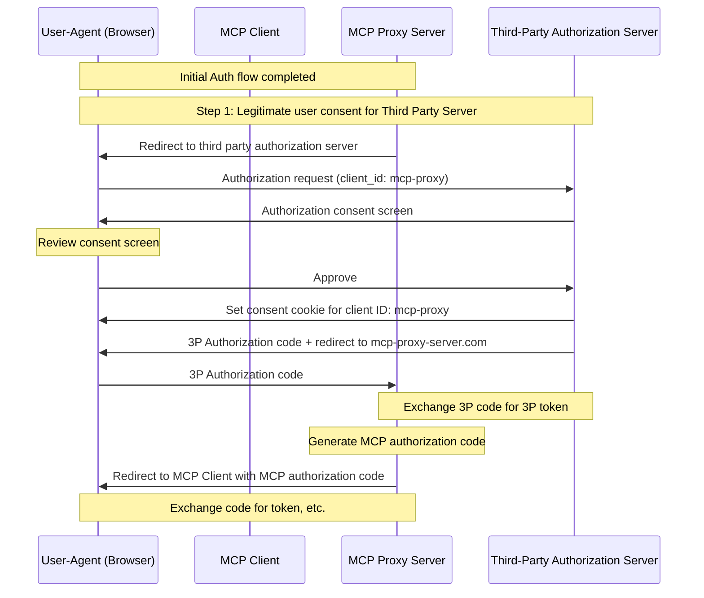
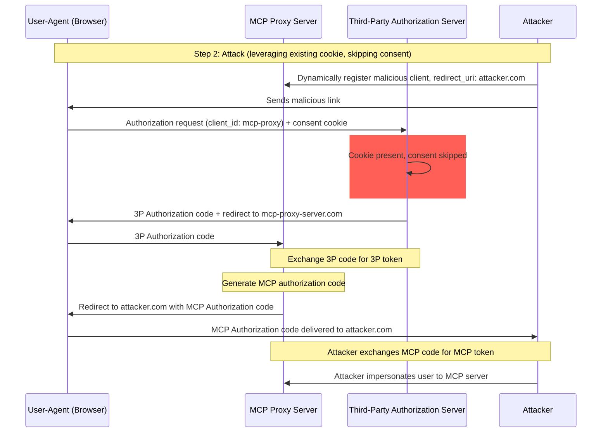
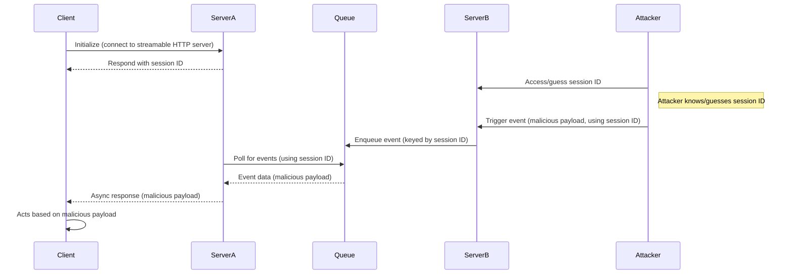
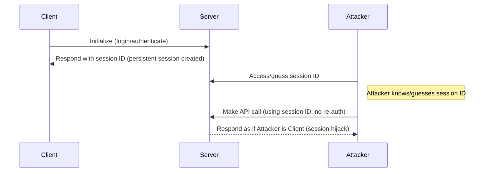

## はじめに

### 目的と適用範囲

本文書は、MCP認可仕様を補完するモデルコンテキストプロトコル（MCP）のセキュリティに関する考慮事項を示します。本文書では、MCP実装に特有のセキュリティリスク、攻撃ベクトル、およびベストプラクティスを特定します。

本文書の主な対象読者は、MCP認可フローを実装する開発者、MCPサーバー運用者、およびMCPベースのシステムを評価するセキュリティ専門家です。本文書は、MCP認可仕様および[OAuth 2.0セキュリティのベストプラクティス](https://datatracker.ietf.org/doc/html/rfc9700)と併せてお読みください。

## 攻撃と緩和策

このセクションでは、MCP実装に対する攻撃と、潜在的な対策について詳しく説明します。

### Confused Deputy問題

攻撃者は、他のリソースサーバーをプロキシするMCPサーバーを悪用し、「[Confused Deputy](https://en.wikipedia.org/wiki/Confused_deputy_problem)」脆弱性を作り出す可能性があります。

#### 用語

**MCP プロキシサーバー**
: MCP クライアントをサードパーティ API に接続し、MCP 機能を提供しながら操作を委任し、サードパーティ API サーバーに対して単一の OAuth クライアントとして機能する MCP サーバー。

**サードパーティ認可サーバー**
: サードパーティ API を保護する認可サーバー。動的なクライアント登録をサポートしていない場合があり、その場合は MCP プロキシはすべてのリクエストに対して静的クライアント ID を使用する必要があります。

**サードパーティ API**
: 実際の API 機能を提供する保護されたリソースサーバー。
この API にアクセスするには、サードパーティ認可サーバーが発行したトークンが必要です。

**静的クライアント ID**
: MCP プロキシサーバーがサードパーティ認可サーバーと通信する際に使用する固定の OAuth 2.0 クライアント ID。
このクライアント ID は、サードパーティ API のクライアントとして機能する MCP サーバーを指します。
どの MCP クライアントがリクエストを開始したかに関係なく、MCP サーバーとサードパーティ API のすべてのやり取りで同じ値になります。

#### アーキテクチャと攻撃フロー

##### 通常のOAuthプロキシの使用（ユーザーの同意を維持）

##### 悪意のある OAuth プロキシの使用 (ユーザーの同意をスキップ)

#### 攻撃の説明

MCPプロキシサーバーが、動的クライアント登録をサポートしていないサードパーティ認可サーバーで静的クライアントIDを使用して認証を行う場合、以下の攻撃が可能になります。

1. ユーザーがMCPプロキシサーバーを介して通常通り認証を行い、サードパーティAPIにアクセスします。
2. このフローにおいて、サードパーティ認可サーバーは、静的クライアントIDへの同意を示すCookieをユーザーエージェントに設定します。
3. 攻撃者はその後、細工された認可リクエストを含む悪意のあるリンクをユーザーに送信します。このリクエストには、悪意のあるリダイレクトURIと、新たに動的に登録されたクライアントIDが含まれています。
4. ユーザーがリンクをクリックしても、ブラウザには以前の正当なリクエストの同意Cookieが残っています。
5. サードパーティ認可サーバーはCookieを検出し、同意画面をスキップします。
6. MCP認可コードは、攻撃者のサーバー（動的クライアント登録時に細工されたredirect_uriで指定）にリダイレクトされます。
7. 攻撃者は、ユーザーの明示的な承認なしに、盗んだ認可コードをMCPサーバーのアクセストークンと交換します。
8. これで、攻撃者はサードパーティAPIに侵害されたユーザーとしてアクセスできるようになります。

#### 緩和策

静的クライアントIDを使用するMCPプロキシサーバーは、動的に登録されたクライアントごとに、サードパーティの認可サーバー（追加の同意が必要となる場合があります）に転送する前に、ユーザーの同意を**取得する必要があります**。

### トークンパススルー

「トークンパススルー」とは、MCPサーバーがMCPクライアントからトークンを受け取り、そのトークンがMCPサーバーに正しく発行されたことを検証せずに、下流のAPIに「パススルー」してしまうアンチパターンです。

#### リスク

トークンパススルーは、[認可仕様](/specification/2025-06-18/basic/authorization)において明示的に禁止されています。これは、次のような多くのセキュリティリスクをもたらすためです。

- **セキュリティ制御の回避**
  - MCPサーバーまたは下流APIは、トークンの対象ユーザーやその他の認証情報制約に依存する、レート制限、リクエスト検証、トラフィック監視などの重要なセキュリティ制御を実装している場合があります。クライアントが、MCPサーバーによる適切な検証や、トークンが適切なサービスに対して発行されたことの確認を行わずに、下流APIを使用してトークンを直接取得・使用できる場合、これらの制御を回避してしまいます。
- **アカウンタビリティと監査証跡の問題**
  - クライアントが上流で発行されたアクセストークンを使用して呼び出しを行う場合、MCPサーバーはMCPクライアントを識別または区別することができません。このアクセストークンはMCPサーバーにとって不透明である可能性があります。
  - 下流リソースサーバーのログには、実際にトークンを転送しているMCPサーバーではなく、異なるIDを持つ別のソースから送信されたように見えるリクエストが記録される場合があります。
  - どちらの要因も、インシデント調査、制御、監査を困難にします。
  - MCPサーバーがトークンのクレーム（ロール、権限、オーディエンスなど）やその他のメタデータを検証せずにトークンを渡すと、盗まれたトークンを所持する悪意のある攻撃者が、そのサーバーをデータ窃取のプロキシとして利用する可能性があります。
- **信頼境界の問題**
  - 下流リソースサーバーは特定のエンティティに信頼を付与します。この信頼には、オリジンやクライアントの行動パターンに関する想定が含まれる場合があります。この信頼境界を破ると、予期しない問題が発生する可能性があります。
  - トークンが適切な検証なしに複数のサービスに受け入れられた場合、あるサービスを侵害した攻撃者が、そのトークンを使用して他の接続されたサービスにアクセスできるようになります。
- **将来の互換性リスク**
  - MCPサーバーが現在「純粋なプロキシ」として開始されたとしても、後からセキュリティ制御の追加が必要になる可能性があります。適切なトークンオーディエンスの分離から始めると、セキュリティモデルの進化が容易になります。

#### 緩和策

MCP サーバーは、MCP サーバーに対して明示的に発行されていないトークンを受け入れてはなりません（**MUST NOT**）。

### セッションハイジャック

セッションハイジャックとは、サーバーからクライアントにセッションIDが提供され、権限のない第三者がそのセッションIDを取得・使用して元のクライアントになりすまし、不正な操作を実行する攻撃手法です。

#### セッションハイジャックプロンプトインジェクション

#### セッションハイジャックのなりすまし

#### 攻撃の説明

MCPリクエストを処理するステートフルHTTPサーバーが複数存在する場合、以下の攻撃ベクトルが考えられます。

**セッションハイジャック・プロンプトインジェクション**

1. クライアントが**サーバーA**に接続し、セッションIDを取得します。
1. 攻撃者は既存のセッションIDを取得し、そのセッションIDを使用して**サーバーB**に悪意のあるイベントを送信します。

  - サーバーが[再配信/再開可能なストリーム](/specification/2025-06-18/basic/transports#resumability-and-redelivery)をサポートしている場合、レスポンスを受信する前にリクエストを意図的に終了させると、元のクライアントがサーバー送信イベントのGETリクエストを介してリクエストを再開できる可能性があります。
  - 特定のサーバーが、`notifications/tools/list_changed`などのツール呼び出しの結果としてサーバー送信イベントを開始した場合、サーバーが提供するツールに影響を与える可能性があります。クライアントは、有効化されていることに気付いていないツールを使用せざるを得なくなる可能性があります。

1. **サーバーB** は、セッションIDに関連付けられたイベントを共有キューに追加します。
1. **サーバーA** は、セッションIDを使用してキュー内のイベントをポーリングし、悪意のあるペイロードを取得します。
1. **サーバーA** は、悪意のあるペイロードを非同期レスポンスまたは再開レスポンスとしてクライアントに送信します。
1. クライアントは悪意のあるペイロードを受信し、それに基づいて操作を行い、潜在的な侵害を引き起こします。

**セッションハイジャック（なりすまし）**

1. MCPクライアントはMCPサーバーで認証を行い、永続的なセッションIDを作成します。
2. 攻撃者はセッションIDを取得します。
3. 攻撃者はセッションIDを使用してMCPサーバーを呼び出します。
4. MCPサーバーは追加の認証を確認せず、攻撃者を正当なユーザーとして扱い、不正なアクセスや操作を許可します。

#### 緩和策

セッションハイジャック攻撃とイベントインジェクション攻撃を防ぐには、以下の緩和策を実装する必要があります。

認可を実装するMCPサーバーは、すべての受信リクエストを検証する必要があります。

MCPサーバーは、認証にセッションを使用してはなりません。

MCPサーバーは、安全で非決定論的なセッションIDを使用する必要があります。

生成されるセッションID（UUIDなど）には、安全な乱数ジェネレータを使用するべきです。攻撃者に推測される可能性のある、予測可能または連続したセッションIDは避けてください。セッションIDをローテーションまたは有効期限切れにすることでも、リスクを軽減できます。

MCPサーバーは、セッションIDをユーザー固有の情報にバインドする必要があります。

セッション関連データを保存または送信する場合（例：キュー内）、セッションIDを、承認されたユーザー固有の情報（内部ユーザーIDなど）と組み合わせます。`<user_id>:<session_id>`のようなキー形式を使用します。これにより、たとえ攻撃者がセッションIDを推測できたとしても、ユーザーIDはユーザートークンから取得され、クライアントから提供されるものではないため、他のユーザーになりすますことはできません。

MCPサーバーは、オプションで追加の固有識別子を利用できます。
