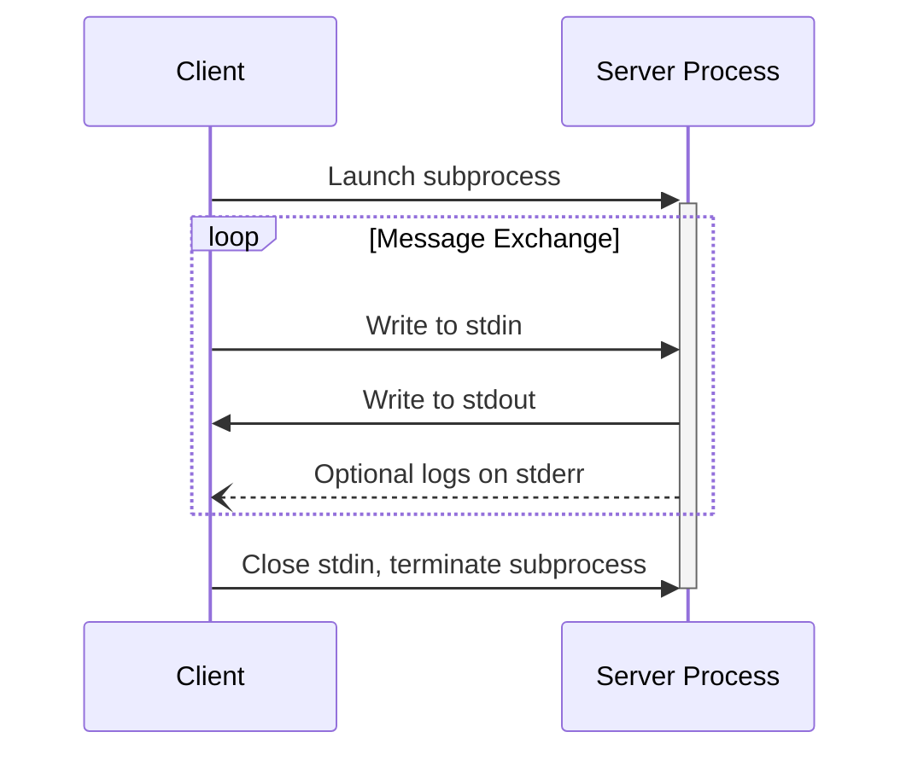
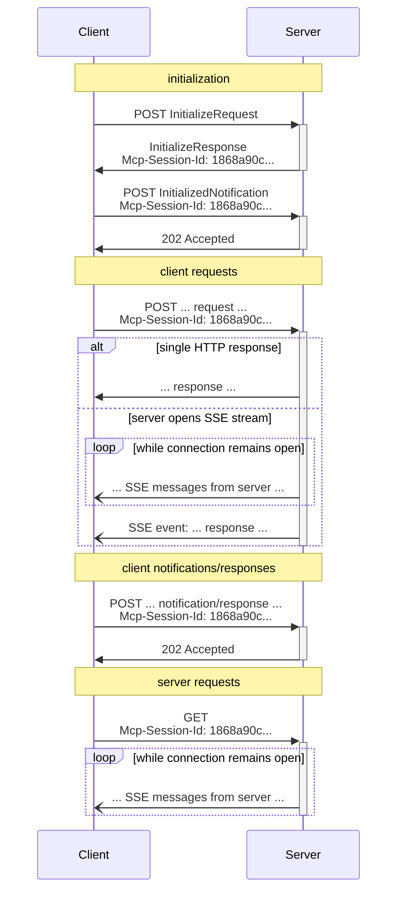

<Info>**Protocol Revision**: 2025-06-18</Info>

MCPはJSON-RPCを使用してメッセージをエンコードします。JSON-RPCメッセージはUTF-8でエンコードされている必要があります（**必須**）。

このプロトコルは現在、クライアント・サーバー間通信用の2つの標準トランスポートメカニズムを定義しています。

1. [stdio](#stdio)：標準入力と標準出力を介した通信
2. [Streamable HTTP](#streamable-http)

クライアントは可能な限りstdioをサポートすべきです（**推奨**）。

クライアントとサーバーは、プラガブルな形式で[カスタムトランスポート](#custom-transports)を実装することもできます。

## stdio

**stdio** トランスポートでは、次のようになります。

- クライアントは MCP サーバーをサブプロセスとして起動します。
- サーバーは標準入力 (`stdin`) から JSON-RPC メッセージを読み取り、標準出力 (`stdout`) に送信します。
- メッセージは、個々の JSON-RPC リクエスト、通知、またはレスポンスです。
- メッセージは改行で区切られ、改行文字を含んではなりません (MUST NOT)。
- サーバーは、ログ出力のために UTF-8 文字列を標準エラー出力 (`stderr`) に書き込むことができます (MAY)。クライアントは、このログ出力をキャプチャ、転送、または無視することができます (MAY NOT)。
- サーバーは、有効な MCP メッセージ以外のものを `stdout` に書き込んではなりません (MUST NOT)。
- クライアントは、有効な MCP メッセージ以外のものをサーバーの `stdin` に書き込んではなりません (MUST NOT)。

## ストリーミング可能なHTTP

<Info>

これは、プロトコルバージョン2024-11-05の[HTTP+SSEトランスポート](/specification/2024-11-05/basic/transports#http-with-sse)を置き換えるものです。
以下の[後方互換性](#backwards-compatibility)ガイドをご覧ください。

</Info>

**ストリーミング可能な HTTP** トランスポートでは、サーバーは複数のクライアント接続を処理できる独立したプロセスとして動作します。
このトランスポートは、HTTP POST および GET リクエストを使用します。
サーバーはオプションで [Server-Sent Events](https://en.wikipedia.org/wiki/Server-sent_events) (SSE) を利用して複数のサーバーメッセージをストリーミングできます。
これにより、基本的な MCP サーバーだけでなく、ストリーミングやサーバーからクライアントへの通知とリクエストをサポートする機能豊富なサーバーもサポートできます。

サーバーは、POST メソッドと GET メソッドの両方をサポートする単一の HTTP エンドポイントパス (以下、**MCP エンドポイント** と呼びます) を提供する必要があります。
例えば、これは `https://example.com/mcp` のような URL になります。

#### セキュリティ警告

ストリーミング可能なHTTPトランスポートを実装する場合：

1. サーバーは、DNSリバインディング攻撃を防ぐため、すべての受信接続において「Origin」ヘッダーを検証する必要があります。
2. ローカルで実行する場合、サーバーはすべてのネットワークインターフェース（0.0.0.0）ではなく、ローカルホスト（127.0.0.1）のみにバインドする必要があります。
3. サーバーは、すべての接続に対して適切な認証を実装する必要があります。

これらの保護対策がなければ、攻撃者はDNSリバインディングを利用して、リモートウェブサイトからローカルのMCPサーバーにアクセスできる可能性があります。

### サーバーへのメッセージの送信

クライアントから送信されるすべての JSON-RPC メッセージは、MCP エンドポイントへの新しい HTTP POST リクエストでなければなりません。

1. クライアントは、MCP エンドポイントに JSON-RPC メッセージを送信するために、HTTP POST を使用する必要があります。
2. クライアントは、サポートされるコンテンツタイプとして `application/json` と `text/event-stream` の両方を指定した `Accept` ヘッダーを含める必要があります。
3. POST リクエストのボディは、単一の JSON-RPC _request_、_notification_、または _response_ である必要があります。
4. 入力が JSON-RPC _response_ または _notification_ の場合:
  - サーバーが入力を受け入れた場合、サーバーはボディなしの HTTP ステータスコード 202 Accepted を返す必要があります。
  - サーバーが入力を受け付けられない場合、HTTP エラーステータスコード（例：400 Bad Request）を返す必要があります。HTTP レスポンスボディは、`id` のない JSON-RPC エラーレスポンス **を ** 含む場合があります**。
5. 入力が JSON-RPC リクエスト **の場合、サーバーは SSE ストリームを開始するために `Content-Type: text/event-stream` を返すか、1 つの JSON オブジェクトを返すために `Content-Type: application/json` を返す必要があります**。
クライアントは、これら両方のケースをサポートする必要があります**。
6. サーバーが SSE ストリームを開始する場合:
  - SSE ストリームには、POST ボディで送信された JSON-RPC リクエスト **に対する JSON-RPC レスポンス **が最終的に含まれるべきです**。
  - サーバーは、JSON-RPC レスポンス **を送信する前に、JSON-RPC リクエスト **と通知 **を送信しても構いません**。これらのメッセージは、発信元クライアントのリクエストに関連すべきです。
  - サーバーは、[セッション](#session-management) の有効期限が切れていない限り、受信した JSON-RPC リクエストに対する JSON-RPC レスポンスを送信する前に SSE ストリームを閉じるべきではありません。
  - JSON-RPC レスポンスが送信された後、サーバーは SSE ストリームを閉じるべきです。
  - 切断はいつでも発生する可能性があります (例: ネットワーク状況による)。したがって、次のようになります。
    - 切断は、クライアントがリクエストをキャンセルしたと解釈すべきではありません。
    - キャンセルする場合、クライアントは MCP `CancelledNotification` を明示的に送信すべきです。
    - 切断によるメッセージの損失を回避するため、サーバーはストリームを [再開可能](#resumability-and-redelivery) にすることができます。

### サーバーからのメッセージのリッスン

1. クライアントは、MCPエンドポイントに対してHTTP GETを発行できます。
これによりSSEストリームが開かれ、クライアントがHTTP POSTでデータを送信することなく、サーバーがクライアントと通信できるようになります。
2. クライアントは、サポートされるコンテンツタイプとして「text/event-stream」を指定した「Accept」ヘッダーを含める必要があります。
3. サーバーは、このHTTP GETへのレスポンスとして「Content-Type: text/event-stream」を返すか、そうでない場合はHTTP 405 Method Not Allowed（サーバーがこのエンドポイントでSSEストリームを提供していないことを示す）を返す必要があります。
4. サーバーがSSEストリームを開始した場合：
  - サーバーは、ストリーム上でJSON-RPC _リクエスト_と_通知_を送信できます。
  - これらのメッセージは、クライアントから同時に実行されているJSON-RPC _リクエスト_とは無関係である必要があります。
  - サーバーは、以前のクライアントリクエストに関連付けられたストリームを [再開](#resumability-and-redelivery) しない限り、ストリームに対して JSON-RPC レスポンスを送信してはなりません。
  - サーバーはいつでも SSE ストリームを閉じることができます。
  - クライアントはいつでも SSE ストリームを閉じることができます。

### 複数接続

1. クライアントは複数のSSEストリームに同時に接続したままでいてもよい（MAY）場合があります。
2. サーバーは、接続されたストリームのうち1つにのみJSON-RPCメッセージを送信しなければなりません（MUST）。つまり、複数のストリームに同じメッセージをブロードキャストしてはなりません（MUST NOT）。
- メッセージ損失のリスクは、ストリームを[再開可能](#resumability-and-redelivery)にすることで軽減できます（MAY）

### 再開と再配信

切断された接続の再開と、失われる可能性のあるメッセージの再配信をサポートするには、以下の手順に従います。

1. サーバーは、[SSE 標準](https://html.spec.whatwg.org/multipage/server-sent-events.html#event-stream-interpretation) で説明されているように、SSE イベントに `id` フィールドを付加できます。
- ID が存在する場合、その ID は、その [セッション](#session-management) 内のすべてのストリーム、またはセッション管理が使用されていない場合は、その特定のクライアントのすべてのストリームにわたって、グローバルに一意である必要があります。
2. クライアントが接続切断後に再開を希望する場合、MCPエンドポイントにHTTP GETを発行し、受信した最後のイベントIDを示す[`Last-Event-ID`](https://html.spec.whatwg.org/multipage/server-sent-events.html#the-last-event-id-header)ヘッダーを含めることが**推奨**されます。
- サーバーは、このヘッダーを使用して、切断されたストリーム上の最後のイベントID以降に送信されるはずだったメッセージを再生し、その時点からストリームを再開することができます。
- サーバーは、別のストリームで配信されるはずだったメッセージを再生してはなりません。

言い換えれば、これらのイベントIDは、特定のストリーム内でカーソルとして機能するように、サーバーによってストリームごとに割り当てられるべきです。

### セッション管理

MCP の「セッション」は、クライアントとサーバー間の論理的に関連する相互作用から構成され、[初期化フェーズ](/specification/2025-06-18/basic/lifecycle) から始まります。
ステートフルセッションを確立するサーバーをサポートするには、次の操作を行います。

1. ストリーミング可能な HTTP トランスポートを使用するサーバーは、初期化時にセッション ID を割り当てることができます。セッション ID は、`InitializeResult` を含む HTTP レスポンスの `Mcp-Session-Id` ヘッダーに含めることで割り当てることができます。
- セッション ID は、グローバルに一意で、暗号学的に安全である必要があります (例: 安全に生成された UUID、JWT、または暗号ハッシュ)。
- セッション ID には、表示可能な ASCII 文字 (0x21 から 0x7E の範囲) のみを含める必要があります。
2. 初期化中にサーバーから `Mcp-Session-Id` が返された場合、ストリーミング可能な HTTP トランスポートを使用するクライアントは、以降のすべての HTTP リクエストの `Mcp-Session-Id` ヘッダーにその ID を含める必要があります (**MUST**)。
- セッション ID を必要とするサーバーは、`Mcp-Session-Id` ヘッダーのないリクエスト (初期化時以外) に対して、HTTP 400 Bad Request で応答する必要があります (**SHOULD**)。
3. サーバーはいつでもセッションを終了できます (**MAY**)。終了後は、そのセッション ID を含むリクエストに対して、HTTP 404 Not Found で応答する必要があります (**MUST**)。
4. クライアントが `Mcp-Session-Id` を含むリクエストへの応答として HTTP 404 を受信した場合、セッション ID を添付せずに新しい `InitializeRequest` を送信して、新しいセッションを開始する必要があります (**MUST**)。
5. 特定のセッションが不要になったクライアント（例：ユーザーがクライアントアプリケーションを離れる場合）は、セッションを明示的に終了するために、MCPエンドポイントに「Mcp-Session-Id」ヘッダーを指定したHTTP DELETEを送信することが**推奨**されます。
- サーバーは、このリクエストに対してHTTP 405 Method Not Allowedで応答して、クライアントによるセッションの終了を許可しないことを示すことができます。

### シーケンス図

### プロトコルバージョンヘッダー

HTTPを使用する場合、クライアントはMCPサーバーへの後続のすべてのリクエストに「MCP-Protocol-Version: <protocol-version>」HTTPヘッダーを含める必要があります（**MUST**）。これにより、MCPサーバーはMCPプロトコルバージョンに基づいて応答できます。

例：`MCP-Protocol-Version: 2025-06-18`

クライアントが送信するプロトコルバージョンは、[初期化時にネゴシエートされたバージョン](/specification/2025-06-18/basic/lifecycle#version-negotiation)であるべきです（**SHOULD**）。

後方互換性のため、サーバーが`MCP-Protocol-Version`ヘッダーを受信せず、かつバージョンを識別する他の方法（例えば、初期化時にネゴシエートされたプロトコルバージョンに頼るなど）がない場合、サーバーはプロトコルバージョンを「2025-03-26」と想定すべきです（**SHOULD**）。

サーバーが無効またはサポートされていない `MCP-Protocol-Version` を含むリクエストを受信した場合、 `400 Bad Request` で応答する必要があります。

### 後方互換性

クライアントとサーバーは、非推奨となった[HTTP+SSEトランスポート](/specification/2024-11-05/basic/transports#http-with-sse)（プロトコルバージョン2024-11-05以降）との後方互換性を、以下のように維持できます。

**サーバー**は、古いクライアントをサポートする必要があります。

- ストリーミング可能なHTTPトランスポート用に定義された新しい「MCPエンドポイント」に加えて、古いトランスポートのSSEエンドポイントとPOSTエンドポイントの両方を引き続きホストします。
- 古いPOSTエンドポイントと新しいMCPエンドポイントを組み合わせることも可能ですが、不要な複雑さが生じる可能性があります。

**クライアント**は、古いサーバーをサポートする必要があります。

1. ユーザーからMCPサーバーURLを受け取ります。このURLは、古いトランスポートを使用するサーバーまたは新しいトランスポートを使用するサーバーを指すことができます。
2. 上記で定義した `Accept` ヘッダーを付けて、サーバー URL に `InitializeRequest` を POST 送信します。
- 成功した場合、クライアントはこれが新しいストリーミング可能な HTTP トランスポートをサポートするサーバーであると想定できます。
- HTTP 4xx ステータスコード（例：405 Method Not Allowed または 404 Not Found）で失敗した場合：
- SSE ストリームが開かれ、最初のイベントとして `endpoint` イベントが返されることを想定して、サーバー URL に GET リクエストを発行します。
- `endpoint` イベントが到着すると、クライアントはこれが古い HTTP+SSE トランスポートを実行しているサーバーであると想定し、以降のすべての通信でそのトランスポートを使用する必要があります。

## カスタムトランスポート

クライアントとサーバーは、それぞれのニーズに合わせて追加のカスタムトランスポートメカニズムを実装できます。
このプロトコルはトランスポートに依存せず、双方向メッセージ交換をサポートするあらゆる通信チャネルで実装できます。

カスタムトランスポートをサポートすることを選択した実装者は、MCP で定義された JSON-RPC メッセージ形式とライフサイクル要件に準拠していることを保証しなければなりません。
カスタムトランスポートは、相互運用性を高めるために、固有の接続確立とメッセージ交換パターンを文書化する必要があります。
