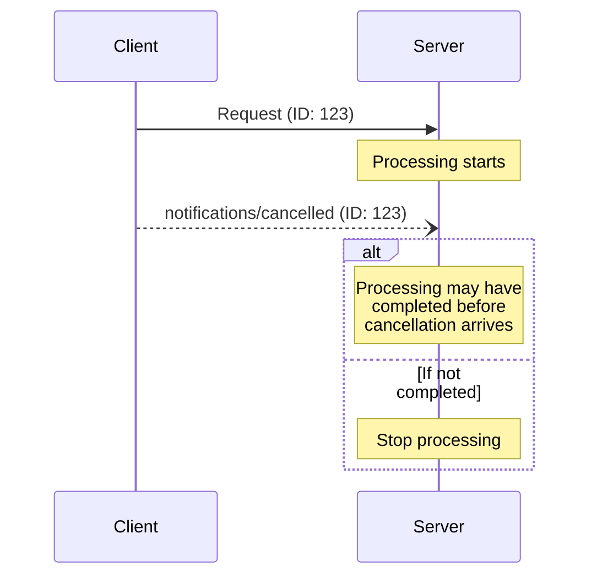

<div id="enable-section-numbers" />

<Info>**Protocol Revision**: 2025-06-18</Info>

モデルコンテキストプロトコル（MCP）は、通知メッセージを通じて進行中のリクエストをオプションでキャンセルすることをサポートしています。
どちらの側も、以前に発行されたリクエストを終了する必要があることを示すキャンセル通知を送信できます。

## キャンセルフロー

進行中のリクエストをキャンセルする場合、以下の情報を含む「notifications/cancelled」通知を送信します。

- キャンセルするリクエストのID
- ログに記録または表示できるオプションの理由文字列

```json
{
  "jsonrpc": "2.0",
  "method": "notifications/cancelled",
  "params": {
    "requestId": "123",
    "reason": "User requested cancellation"
  }
}
```

## B動作要件

1. キャンセル通知は、以下のリクエストのみを参照する必要があります。
   - 同じ方向に以前に発行されたリクエスト
   - まだ処理中であると考えられるリクエスト
2. `initialize` リクエストは、クライアントによってキャンセルされてはなりません。
3. キャンセル通知の受信者は、以下の処理を行うべきです。
   - キャンセルされたリクエストの処理を停止する
   - 関連付けられたリソースを解放する
   - キャンセルされたリクエストに対するレスポンスを送信しない
4. 以下の場合、受信者はキャンセル通知を無視しても構いません。
   - 参照されたリクエストが不明な場合
   - 処理が既に完了している場合
   - リクエストをキャンセルできない場合
5. キャンセル通知の送信者は、それ以降に到着するリクエストに対するレスポンスを無視すべきです。

## タイミングに関する考慮事項

ネットワークの遅延により、キャンセル通知はリクエスト処理が完了した後、場合によってはレスポンスが送信された後に届くことがあります。

双方は、これらの競合状態を適切に処理する必要があります。



## 実装上の注意

- 双方とも、デバッグのためにキャンセル理由をログに記録するべきです（**SHOULD**）
- アプリケーションUIは、キャンセルが要求されたときにそれを表示するべきです（**SHOULD**）

## エラー処理

無効なキャンセル通知は**無視されるべき**です。

- 不明なリクエストID
- すでに完了したリクエスト
- 不正な通知

これにより、非同期通信における競合状態を許容しながらも、通知の「ファイア・アンド・フォーゲット」という性質が維持されます。
