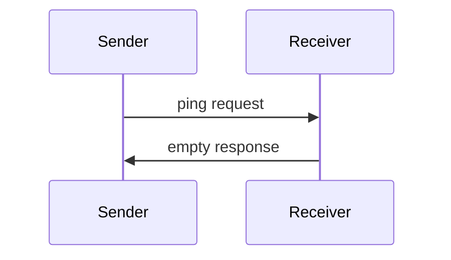

<div id="enable-section-numbers" />

<Info>**Protocol Revision**: 2025-06-18</Info>

モデルコンテキスト プロトコルには、オプションの ping メカニズムが含まれており、これにより、どちらの側も相手側がまだ応答していて接続が維持されていることを確認できます。

## 概要

ping機能は、シンプルなリクエスト/レスポンスパターンで実装されています。
クライアントまたはサーバーは、`ping`リクエストを送信することでpingを開始できます。

## メッセージ形式

pingリクエストは、パラメータのない標準的なJSON-RPCリクエストです。

```json
{
  "jsonrpc": "2.0",
  "id": "123",
  "method": "ping"
}
```

## 行動要件

1. 受信者は**必ず**、空のレスポンスを速やかに返さなければなりません。

```json
{
  "jsonrpc": "2.0",
  "id": "123",
  "result": {}
}
```

2. 妥当なタイムアウト時間内に応答がない場合、送信者は**以下の対応をしてもよい**:
  - 接続が古いと判断する
  - 接続を終了する
  - 再接続手順を試行する

## 使用パターン



## 実装に関する考慮事項

- 実装では、接続の健全性を確認するために定期的にpingを発行する**べき**です。
- pingの頻度は設定可能である**べき**です。
- タイムアウトはネットワーク環境に応じて適切に設定されるべき**です。
- ネットワークのオーバーヘッドを削減するため、過度なpingは避けるべき**です。

## エラー処理

- タイムアウトは接続失敗として扱うべきである（SHOULD）
- pingが複数回失敗した場合、接続がリセットされる可能性がある（MAY）
- 実装では、診断のためにpingの失敗をログに記録すべきである（SHOULD）
