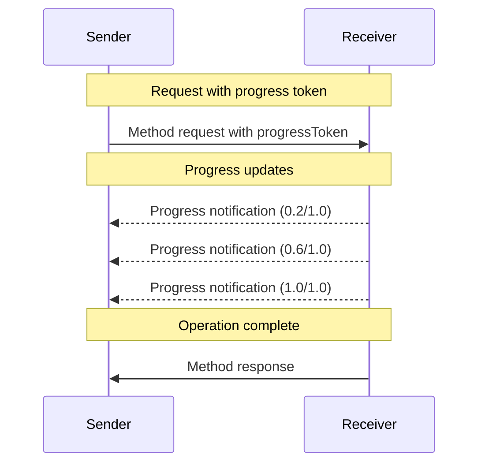

<div id="enable-section-numbers" />

<Info>**Protocol Revision**: 2025-06-18</Info>

モデルコンテキストプロトコル（MCP）は、通知メッセージを通じて、長時間実行される操作の進行状況を追跡するオプションをサポートしています。
どちらの側も進行状況通知を送信して、操作のステータスに関する最新情報を提供できます。

## 進捗フロー

リクエストの進捗状況の更新を_受信_したい場合、リクエストメタデータに「progressToken」を含めます。

- 進捗トークンは文字列または整数値である必要があります。
- 進捗トークンは送信者が任意の方法で選択できますが、アクティブなリクエスト全体で一意である必要があります。

```json
{
  "jsonrpc": "2.0",
  "id": 1,
  "method": "some_method",
  "params": {
    "_meta": {
      "progressToken": "abc123"
    }
  }
}
```

受信者は**送信してもよい**（MAY）:

- 元の進捗トークン
- これまでの進捗値
- オプションの「合計」値
- オプションの「メッセージ」値

```json
{
  "jsonrpc": "2.0",
  "method": "notifications/progress",
  "params": {
    "progressToken": "abc123",
    "progress": 50,
    "total": 100,
    "message": "Reticulating splines..."
  }
}
```

- `progress` 値は、合計が不明な場合でも、通知ごとに増加する必要があります。
- `progress` 値と `total` 値は浮動小数点数であっても構いません。
- `message` フィールドには、人間が判読できる適切な進捗情報を提供する必要があります。

## 動作要件

1. 進捗通知は、以下のトークンのみを参照する必要があります。
  - アクティブなリクエストで提供されたトークン
  - 進行中の操作に関連付けられているトークン

2. 進捗リクエストの受信者は、以下の操作を実行できます。
  - 進捗通知を送信しない
  - 適切と判断した頻度で通知を送信する
  - 合計値が不明な場合は省略する



## 実装上の注意

- 送信側と受信側は、アクティブな進捗トークンを追跡する**べき**です
- 双方とも、フラッディングを防ぐためレート制限を実装する**べき**です
- 進捗通知は完了後に停止する**べき**です