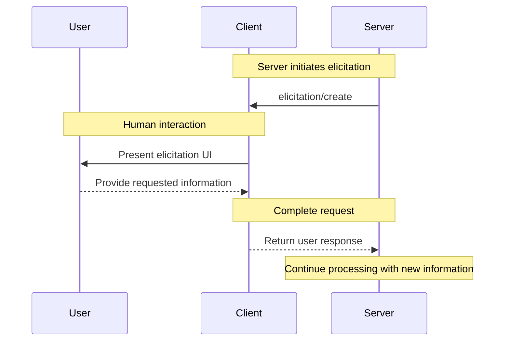

<div id="enable-section-numbers" />

<Info>**Protocol Revision**: 2025-06-18</Info>

<Note>

MCP 仕様のこのバージョンでは、Elicisation が新たに導入されており、その設計は将来のプロトコル バージョンで進化する可能性があります。

</Note>

モデルコンテキストプロトコル（MCP）は、サーバーがクライアントを介してユーザーとのやり取り中にユーザーに追加情報を要求するための標準化された方法を提供します。
このフローにより、クライアントはユーザーとのやり取りとデータ共有を制御しながら、サーバーが必要な情報を動的に収集できるようになります。
サーバーは、JSONスキーマを使用して構造化データをユーザーに要求し、レスポンスを検証します。

## ユーザーインタラクションモデル

MCPにおける誘導（Elicitation）は、ユーザー入力リクエストを他のMCPサーバー機能内にネストして発生させることで、サーバーがインタラクティブなワークフローを実装することを可能にします。

実装は、ニーズに合った任意のインターフェースパターンを通じて誘導を自由に公開できます。プロトコル自体は特定のユーザーインタラクションモデルを必須としていません。

<Warning>

信頼性、安全性、セキュリティのために：

- サーバーは、機密情報を要求するために誘導法を使用してはなりません。

アプリケーションは、次の事項を行うべきです。

- どのサーバーが情報を要求しているかを明確に示す UI を提供する
- ユーザーが送信前に応答内容を確認・修正できるようにする
- ユーザーのプライバシーを尊重し、明確な拒否およびキャンセルの選択肢を提供する

</Warning>

## 機能

Elicitation をサポートするクライアントは、[初期化](/specification/2025-06-18/basic/lifecycle#initialization) 中に `elicitation` 機能を宣言する必要があります。**MUST**

```json
{
  "capabilities": {
    "elicitation": {}
  }
}
```

## Protocol Messages

### Creating Elicitation Requests

ユーザーから情報をリクエストするために、サーバーは `elicitation/create` リクエストを送信します。

#### シンプルなテキストリクエスト

**リクエスト:**

```json
{
  "jsonrpc": "2.0",
  "id": 1,
  "method": "elicitation/create",
  "params": {
    "message": "Please provide your GitHub username",
    "requestedSchema": {
      "type": "object",
      "properties": {
        "name": {
          "type": "string"
        }
      },
      "required": ["name"]
    }
  }
}
```

**レスポンス:**

```json
{
  "jsonrpc": "2.0",
  "id": 1,
  "result": {
    "action": "accept",
    "content": {
      "name": "octocat"
    }
  }
}
```

#### 構造化データリクエスト

**リクエスト:**

```json
{
  "jsonrpc": "2.0",
  "id": 2,
  "method": "elicitation/create",
  "params": {
    "message": "Please provide your contact information",
    "requestedSchema": {
      "type": "object",
      "properties": {
        "name": {
          "type": "string",
          "description": "Your full name"
        },
        "email": {
          "type": "string",
          "format": "email",
          "description": "Your email address"
        },
        "age": {
          "type": "number",
          "minimum": 18,
          "description": "Your age"
        }
      },
      "required": ["name", "email"]
    }
  }
}
```

**レスポンス:**

```json
{
  "jsonrpc": "2.0",
  "id": 2,
  "result": {
    "action": "accept",
    "content": {
      "name": "Monalisa Octocat",
      "email": "octocat@github.com",
      "age": 30
    }
  }
}
```

**拒否レスポンスの例:**

```json
{
  "jsonrpc": "2.0",
  "id": 2,
  "result": {
    "action": "decline"
  }
}
```

**キャンセルレスポンスの例:**

```json
{
  "jsonrpc": "2.0",
  "id": 2,
  "result": {
    "action": "cancel"
  }
}
```

## メッセージフロー



## リクエストスキーマ

`requestedSchema` フィールドを使用すると、サーバーは JSON スキーマの限定されたサブセットを使用して、期待されるレスポンスの構造を定義できます。クライアントの実装を簡素化するため、抽出スキーマはプリミティブプロパティのみを持つフラットオブジェクトに制限されています。

```json
"requestedSchema": {
  "type": "object",
  "properties": {
    "propertyName": {
      "type": "string",
      "title": "Display Name",
      "description": "Description of the property"
    },
    "anotherProperty": {
      "type": "number",
      "minimum": 0,
      "maximum": 100
    }
  },
  "required": ["propertyName"]
}
```

### サポートされているスキーマ型

スキーマは以下のプリミティブ型に制限されています。

1. **文字列スキーマ**

   ```json
   {
     "type": "string",
     "title": "Display Name",
     "description": "Description text",
     "minLength": 3,
     "maxLength": 50,
     "format": "email" // Supported: "email", "uri", "date", "date-time"
   }
   ```

   Supported formats: `email`, `uri`, `date`, `date-time`

2. **数値スキーマ**

   ```json
   {
     "type": "number", // or "integer"
     "title": "Display Name",
     "description": "Description text",
     "minimum": 0,
     "maximum": 100
   }
   ```

3. **ブールスキーマ**

   ```json
   {
     "type": "boolean",
     "title": "Display Name",
     "description": "Description text",
     "default": false
   }
   ```

4. **列挙型スキーマ**

   ```json
   {
     "type": "string",
     "title": "Display Name",
     "description": "Description text",
     "enum": ["option1", "option2", "option3"],
     "enumNames": ["Option 1", "Option 2", "Option 3"]
   }
   ```

クライアントはこのスキーマを使用して、次のことを行うことができます。

1. 適切な入力フォームを生成する
2. 送信前にユーザー入力を検証する
3. ユーザーへの適切なガイダンスを提供する

クライアント実装を簡素化するため、複雑なネスト構造、オブジェクトの配列、その他の高度なJSONスキーマ機能は意図的にサポートされていないことに注意してください。

## 応答アクション

誘導応答では、3つのアクションモデルを使用して、異なるユーザーアクションを明確に区別します。

```json
{
  "jsonrpc": "2.0",
  "id": 1,
  "result": {
    "action": "accept", // or "decline" or "cancel"
    "content": {
      "propertyName": "value",
      "anotherProperty": 42
    }
  }
}
```

レスポンスアクションは3つあります。

1. **承認** (`action: "accept"`): ユーザーが明示的に承認し、データを送信しました。

  - `content` フィールドには、要求されたスキーマに一致する送信データが含まれます。
  - 例: ユーザーが「送信」、「OK」、「確認」などをクリックした。

2. **拒否** (`action: "decline"`): ユーザーがリクエストを明示的に拒否しました。

  - `content` フィールドは通常省略されます。
  - 例: ユーザーが「拒否」、「拒否」、「いいえ」などをクリックした。

3. **キャンセル** (`action: "cancel"`): ユーザーが明示的な選択を行わずにダイアログを閉じました。

  - `content` フィールドは通常省略されます。
  - 例: ユーザーがダイアログを閉じた、ダイアログの外側をクリックした、Esc キーを押したなど。

サーバーは各状態を適切に処理する必要があります。

  - **承認**: 送信されたデータを処理する。
  - **拒否**: 明示的な拒否を処理する (例: 代替案を提示する)。
  - **キャンセル**: 拒否を処理する（例：後で再度プロンプトを表示する）

## セキュリティに関する考慮事項

1. サーバーは、誘導を通じて機密情報を要求してはなりません（**してはいけません**）。
2. クライアントは、ユーザー承認制御を実装する必要があります（**すべき**）。
3. 双方は、提供されたスキーマに基づいて誘導コンテンツを検証する必要があります（**すべき**）。
4. クライアントは、どのサーバーが情報を要求しているかを明確に示す必要があります（**すべき**）。
5. クライアントは、ユーザーがいつでも誘導要求を拒否できるようにする必要があります（**すべき**）。
6. クライアントは、レート制限を実装する必要があります（**すべき**）。
7. クライアントは、どのような情報が要求され、なぜ要求されるのかを明確に示す方法で誘導要求を提示する必要があります（**すべき**）。
