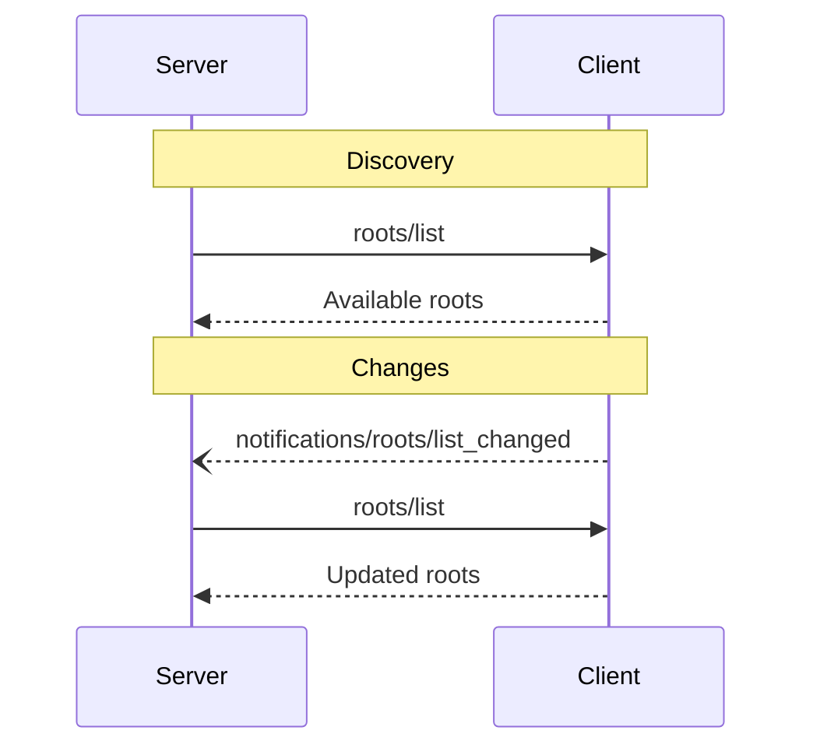

<div id="enable-section-numbers" />

<Info>**Protocol Revision**: 2025-06-18</Info>

モデルコンテキストプロトコル（MCP）は、クライアントがファイルシステムの「ルート」をサーバーに公開するための標準化された方法を提供します。
ルートは、サーバーがファイルシステム内で操作できる範囲の境界を定義し、サーバーがアクセスできるディレクトリとファイルを把握できるようにします。
サーバーは、サポートするクライアントにルートのリストを要求し、リストが変更されたときに通知を受け取ることができます。

## ユーザーインタラクションモデル

MCP におけるルートは通常、ワークスペースまたはプロジェクト設定インターフェースを通じて公開されます。

例えば、実装では、ユーザーがサーバーにアクセスを許可するディレクトリやファイルを選択できるワークスペース/プロジェクトピッカーを提供できます。
これは、バージョン管理システムやプロジェクトファイルからのワークスペースの自動検出と組み合わせることができます。

ただし、実装はニーズに合った任意のインターフェースパターンを通じてルートを自由に公開できます。プロトコル自体は特定のユーザーインタラクションモデルを必須としていません。

## 機能

ルートをサポートするクライアントは、[初期化](/specification/2025-06-18/basic/lifecycle#initialization) 中に `roots` 機能を宣言する必要があります。**必須**

```json
{
  "capabilities": {
    "roots": {
      "listChanged": true
    }
  }
}
```

`listChanged` は、ルートのリストが変更されたときにクライアントが通知を発行するかどうかを示します。

## プロトコルメッセージ

### ルートの一覧表示

ルートを取得するために、サーバーは `roots/list` リクエストを送信します。

**リクエスト：**

```json
{
  "jsonrpc": "2.0",
  "id": 1,
  "method": "roots/list"
}
```

**レスポンス:**

```json
{
  "jsonrpc": "2.0",
  "id": 1,
  "result": {
    "roots": [
      {
        "uri": "file:///home/user/projects/myproject",
        "name": "My Project"
      }
    ]
  }
}
```

### ルートリストの変更

ルートが変更された場合、`listChanged` をサポートするクライアントは**必ず**通知を送信する必要があります。

```json
{
  "jsonrpc": "2.0",
  "method": "notifications/roots/list_changed"
}
```

## メッセージフロー



## データ型

### ルート

ルート定義には以下が含まれます。

- `uri`: ルートの一意の識別子。現在の仕様では、`file://` URI でなければなりません。
- `name`: 表示用に人間が読める名前（任意）。

様々なユースケースにおけるルートの例：

#### プロジェクトディレクトリ

```json
{
  "uri": "file:///home/user/projects/myproject",
  "name": "My Project"
}
```

#### 複数のリポジトリ

```json
[
  {
    "uri": "file:///home/user/repos/frontend",
    "name": "Frontend Repository"
  },
  {
    "uri": "file:///home/user/repos/backend",
    "name": "Backend Repository"
  }
]
```

## エラー処理

クライアントは、一般的な失敗ケースに対して標準の JSON-RPC エラーを返す必要があります (SHOULD)。

- クライアントがルートをサポートしていません: `-32601` (メソッドが見つかりません)
- 内部エラー: `-32603`

エラー例:

```json
{
  "jsonrpc": "2.0",
  "id": 1,
  "error": {
    "code": -32601,
    "message": "Roots not supported",
    "data": {
      "reason": "Client does not have roots capability"
    }
  }
}
```

## セキュリティに関する考慮事項

1. クライアントは**必須**です。

  - 適切な権限を持つルートのみを公開する。
  - パストラバーサルを防止するため、すべてのルートURIを検証する。
  - 適切なアクセス制御を実装する。
  - ルートのアクセス可能性を監視する。

2. サーバーは**推奨**です。

  - ルートが利用できなくなった場合に対処する。
  - 操作中はルート境界を尊重する。
  - 提供されたルートに対してすべてのパスを検証する。

## 実装ガイドライン

1. クライアントは**すべき**:

  - ルート情報をサーバーに公開する前に、ユーザーの同意を求める
  - ルート情報管理用の明確なユーザーインターフェースを提供する
  - 公開する前にルート情報へのアクセス可能性を検証する
  - ルート情報の変更を監視する

2. サーバーは**すべき**:

  - 使用前にルート権限を確認する
  - ルートリストの変更を適切に処理する
  - 操作においてルート情報の境界を尊重する
  - ルート情報を適切にキャッシュする
