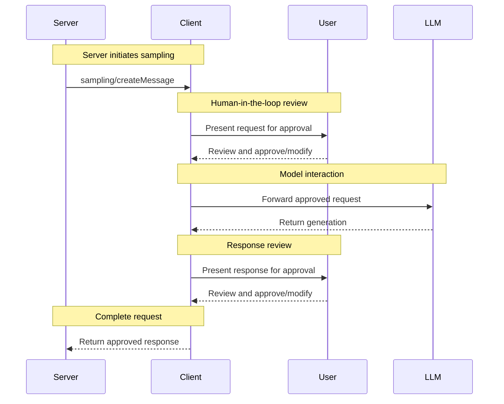

<div id="enable-section-numbers" />

<Info>**Protocol Revision**: 2025-06-18</Info>

モデルコンテキストプロトコル（MCP）は、サーバーがクライアントを介して言語モデルにLLMサンプリング（「補完」または「生成」）を要求するための標準化された方法を提供します。
このフローにより、クライアントはモデルへのアクセス、選択、および権限を制御しながら、サーバーがAI機能を活用できるようになります。サーバーAPIキーは必要ありません。
サーバーはテキスト、音声、または画像ベースのインタラクションを要求でき、オプションでMCPサーバーからのコンテキストをプロンプトに含めることができます。

## ユーザーインタラクションモデル

MCP のサンプリングにより、LLM 呼び出しを他の MCP サーバー機能内にネストして実行できるようになり、サーバーはエージェント的な動作を実装できます。

実装は、ニーズに合った任意のインターフェースパターンを通じてサンプリングを自由に公開できます。プロトコル自体は特定のユーザーインタラクションモデルを必須としていません。

<Warning>

信頼性、安全性、セキュリティを確保するため、サンプリングリクエストを拒否できる人間が常に関与するべきです。

アプリケーションは以下を実施すべきです。

- サンプリングリクエストを簡単かつ直感的に確認できるUIを提供する
- ユーザーが送信前にプロンプトを表示・編集できるようにする
- 生成されたレスポンスを配信前に確認用に提示する

</Warning>

## 機能

サンプリングをサポートするクライアントは、[初期化](/specification/2025-06-18/basic/lifecycle#initialization) 中に `sampling` 機能を宣言する必要があります。

```json
{
  "capabilities": {
    "sampling": {}
  }
}
```

## プロトコルメッセージ

### メッセージの作成

言語モデルの生成を要求するために、サーバーは `sampling/createMessage` リクエストを送信します。

**リクエスト:**

```json
{
  "jsonrpc": "2.0",
  "id": 1,
  "method": "sampling/createMessage",
  "params": {
    "messages": [
      {
        "role": "user",
        "content": {
          "type": "text",
          "text": "What is the capital of France?"
        }
      }
    ],
    "modelPreferences": {
      "hints": [
        {
          "name": "claude-3-sonnet"
        }
      ],
      "intelligencePriority": 0.8,
      "speedPriority": 0.5
    },
    "systemPrompt": "You are a helpful assistant.",
    "maxTokens": 100
  }
}
```

**レスポンス:**

```json
{
  "jsonrpc": "2.0",
  "id": 1,
  "result": {
    "role": "assistant",
    "content": {
      "type": "text",
      "text": "The capital of France is Paris."
    },
    "model": "claude-3-sonnet-20240307",
    "stopReason": "endTurn"
  }
}
```

## メッセージフロー



## データ型

### メッセージ

サンプリングメッセージには以下が含まれます。

#### Text Content

```json
{
  "type": "text",
  "text": "The message content"
}
```

#### Image Content

```json
{
  "type": "image",
  "data": "base64-encoded-image-data",
  "mimeType": "image/jpeg"
}
```

#### Audio Content

```json
{
  "type": "audio",
  "data": "base64-encoded-audio-data",
  "mimeType": "audio/wav"
}
```

### モデル設定

MCPにおけるモデル選択には、サーバーとクライアントが異なるAIプロバイダーを利用し、それぞれ異なるモデルを提供している可能性があるため、慎重な抽象化が必要です。

サーバーは、クライアントが特定のモデルにアクセスできない場合や、別のプロバイダーの同等のモデルを使用することを好む場合があるため、単に名前で特定のモデルを要求することはできません。

この問題を解決するために、MCPは、抽象的な機能の優先順位とオプションのモデルヒントを組み合わせた設定システムを実装しています。

#### 機能の優先度

サーバーは、3つの正規化された優先度値（0～1）でニーズを表します。

- `costPriority`: コストの最小化はどの程度重要ですか？値が高いほど、より安価なモデルが優先されます。
- `speedPriority`: 低レイテンシはどの程度重要ですか？値が高いほど、より高速なモデルが優先されます。
- `intelligencePriority`: 高度な機能はどの程度重要ですか？値が高いほど、より高性能なモデルが優先されます。

#### モデルヒント

優先順位は特性に基づいてモデルを選択するのに役立ちますが、「ヒント」はサーバーが特定のモデルまたはモデルファミリーを提案できるようにします。

- ヒントは、モデル名に柔軟に一致できる部分文字列として扱われます。
- 複数のヒントは優先順位に従って評価されます。
- クライアントは、ヒントを異なるプロバイダーの同等のモデルにマッピングできます。
- ヒントは参考用であり、最終的なモデル選択はクライアントが行います。

例えば：

```json
{
  "hints": [
    { "name": "claude-3-sonnet" }, // Prefer Sonnet-class models
    { "name": "claude" } // Fall back to any Claude model
  ],
  "costPriority": 0.3, // Cost is less important
  "speedPriority": 0.8, // Speed is very important
  "intelligencePriority": 0.5 // Moderate capability needs
}
```

クライアントはこれらの設定を処理して、利用可能なオプションから適切なモデルを選択します。
例えば、クライアントがClaudeモデルにアクセスできないがGeminiを持っている場合、同様の機能に基づいてsonnetヒントを`gemini-1.5-pro`にマッピングする可能性があります。

## エラー処理

クライアントは、一般的な失敗事例に対してエラーを返す必要があります（**SHOULD**）。

エラー例：

```json
{
  "jsonrpc": "2.0",
  "id": 1,
  "error": {
    "code": -1,
    "message": "User rejected sampling request"
  }
}
```

## セキュリティに関する考慮事項

1. クライアントはユーザー承認制御を実装するべきである
2. 双方はメッセージ内容を検証するべきである
3. クライアントはモデル設定のヒントを尊重するべきである
4. クライアントはレート制限を実装するべきである
5. 双方は機密データを適切に処理しなければならない
