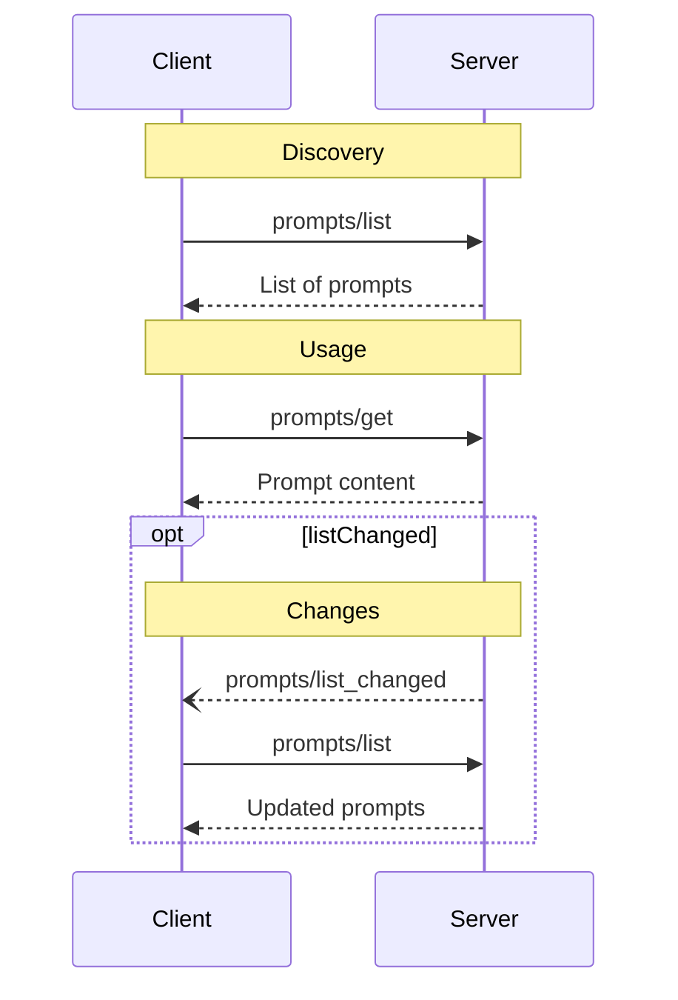

<div id="enable-section-numbers" />

<Info>**Protocol Revision**: 2025-06-18</Info>

モデルコンテキストプロトコル（MCP）は、サーバーがクライアントにプロンプトテンプレートを公開するための標準化された方法を提供します。
プロンプトにより、サーバーは言語モデルと対話するための構造化されたメッセージと指示を提供できます。
クライアントは利用可能なプロンプトを検出し、その内容を取得し、引数を指定してカスタマイズできます。

## ユーザーインタラクションモデル

プロンプトは**ユーザー制御**されるように設計されています。つまり、ユーザーが明示的に選択して使用できるように、サーバーからクライアントに公開されます。

通常、プロンプトはユーザーインターフェース上でユーザーが開始するコマンドによってトリガーされます。これにより、ユーザーは利用可能なプロンプトを自然に見つけて呼び出すことができます。

例えば、スラッシュコマンドとして：


ただし、実装者はニーズに合った任意のインターフェースパターンを通じてプロンプトを公開できます。プロトコル自体は特定のユーザーインタラクションモデルを必須としていません。

## 機能

プロンプトをサポートするサーバーは、[初期化](/specification/2025-06-18/basic/lifecycle#initialization) 中に `prompts` 機能を宣言する必要があります。**MUST**

```json
{
  "capabilities": {
    "prompts": {
      "listChanged": true
    }
  }
}
```

`listChanged` は、使用可能なプロンプトのリストが変更されたときにサーバーが通知を発行するかどうかを示します。

## プロトコルメッセージ

### プロンプトの一覧表示

利用可能なプロンプトを取得するには、クライアントは `prompts/list` リクエストを送信します。この操作は [ページネーション](/specification/2025-06-18/server/utilities/pagination) をサポートしています。

**リクエスト：**

```json
{
  "jsonrpc": "2.0",
  "id": 1,
  "method": "prompts/list",
  "params": {
    "cursor": "optional-cursor-value"
  }
}
```

**レスポンス:**

```json
{
  "jsonrpc": "2.0",
  "id": 1,
  "result": {
    "prompts": [
      {
        "name": "code_review",
        "title": "Request Code Review",
        "description": "Asks the LLM to analyze code quality and suggest improvements",
        "arguments": [
          {
            "name": "code",
            "description": "The code to review",
            "required": true
          }
        ]
      }
    ],
    "nextCursor": "next-page-cursor"
  }
}
```

### プロンプトの取得

特定のプロンプトを取得するには、クライアントは `prompts/get` リクエストを送信します。引数は [補完 API](/specification/2025-06-18/server/utilities/completion) を通じて自動補完される場合があります。

**リクエスト:**

```json
{
  "jsonrpc": "2.0",
  "id": 2,
  "method": "prompts/get",
  "params": {
    "name": "code_review",
    "arguments": {
      "code": "def hello():\n    print('world')"
    }
  }
}
```

**レスポンス:**

```json
{
  "jsonrpc": "2.0",
  "id": 2,
  "result": {
    "description": "Code review prompt",
    "messages": [
      {
        "role": "user",
        "content": {
          "type": "text",
          "text": "Please review this Python code:\ndef hello():\n    print('world')"
        }
      }
    ]
  }
}
```

### リスト変更通知

利用可能なプロンプトのリストが変更された場合、`listChanged` 機能を宣言したサーバーは**通知を送信すべき**です。

```json
{
  "jsonrpc": "2.0",
  "method": "notifications/prompts/list_changed"
}
```

## メッセージフロー



## データ型

### プロンプト

プロンプト定義には以下が含まれます。

- `name`: プロンプトの一意の識別子
- `title`: 表示用に人間が判読できるプロンプト名（オプション）
- `description`: 人間が判読できる説明（オプション）
- `arguments`: カスタマイズ用の引数リスト（オプション）n

### プロンプトメッセージ

プロンプト内のメッセージには以下を含めることができます。

- `role`: 話者を示す「user」または「assistant」のいずれか
- `content`: 以下のいずれかのコンテンツタイプ

<Note>
  プロンプトメッセージ内のすべてのコンテンツタイプは、対象者、優先度、変更時刻に関するメタデータについてオプションの[アノテーション](/specification/2025-06-18/server/resources#annotations)をサポートしています。
</Note>

#### Text Content

テキスト コンテンツはプレーン テキスト メッセージを表します。

```json
{
  "type": "text",
  "text": "The text content of the message"
}
```

これは、自然言語によるやりとりに使用される最も一般的なコンテンツ タイプです。

#### Image Content

画像コンテンツを使用すると、メッセージに視覚的な情報を含めることができます。

```json
{
  "type": "image",
  "data": "base64-encoded-image-data",
  "mimeType": "image/png"
}
```

画像データは**必ず**Base64エンコードされ、有効なMIMEタイプが含まれている必要があります。
これにより、視覚的なコンテキストが重要なマルチモーダルインタラクションが可能になります。

#### Audio Content

オーディオ コンテンツを使用すると、メッセージにオーディオ情報を含めることができます。

```json
{
  "type": "audio",
  "data": "base64-encoded-audio-data",
  "mimeType": "audio/wav"
}
```

音声データはBase64でエンコードされ、有効なMIMEタイプが含まれている必要があります。
これにより、音声コンテキストが重要なマルチモーダルインタラクションが可能になります。

#### 埋め込みリソース

埋め込みリソースを使用すると、メッセージ内でサーバー側のリソースを直接参照できます。

```json
{
  "type": "resource",
  "resource": {
    "uri": "resource://example",
    "name": "example",
    "title": "My Example Resource",
    "mimeType": "text/plain",
    "text": "Resource content"
  }
}
```

リソースにはテキストまたはバイナリ（BLOB）データを含めることができ、以下の要素を**必ず**含める必要があります。

- 有効なリソースURI
- 適切なMIMEタイプ
- テキストコンテンツまたはBase64エンコードされたBLOBデータ

埋め込みリソースを使用すると、ドキュメント、コードサンプル、その他の参考資料など、サーバー管理コンテンツをプロンプトの会話フローにシームレスに組み込むことができます。

## エラー処理

サーバーは、一般的な失敗ケースに対して標準のJSON-RPCエラーを返す必要があります（**SHOULD**）。

- プロンプト名が無効: `-32602` (無効なパラメータ)
- 必須の引数が不足: `-32602` (無効なパラメータ)
- 内部エラー: `-32603` (内部エラー)

## 実装上の考慮事項

1. サーバーは、処理前にプロンプト引数を検証するべきである（SHOULD）
2. クライアントは、大規模なプロンプトリストのページネーションを処理するべきである（SHOULD）
3. 双方は、機能ネゴシエーションを尊重すべきである（SHOULD）

## セキュリティ

実装では、インジェクション攻撃やリソースへの不正アクセスを防ぐため、すべてのプロンプトの入力と出力を慎重に検証する必要があります。
