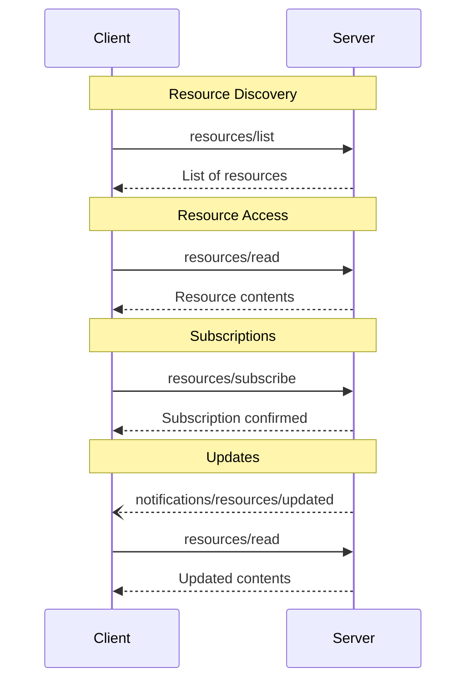

<div id="enable-section-numbers" />

<Info>**Protocol Revision**: 2025-06-18</Info>

モデルコンテキストプロトコル（MCP）は、サーバーがクライアントにリソースを公開するための標準化された方法を提供します。
リソースにより、サーバーはファイル、データベーススキーマ、アプリケーション固有の情報など、言語モデルのコンテキストを提供するデータを共有できます。
各リソースは[URI](https://datatracker.ietf.org/doc/html/rfc3986)によって一意に識別されます。

## ユーザーインタラクションモデル

MCP のリソースは **アプリケーション駆動型** として設計されており、ホストアプリケーションはニーズに基づいてコンテキストをどのように組み込むかを決定します。

例えば、アプリケーションは次のようなことが可能です。

- ツリービューまたはリストビューで、明示的に選択できるように UI 要素を通じてリソースを公開する
- ユーザーが利用可能なリソースを検索およびフィルタリングできるようにする
- ヒューリスティックまたは AI モデルの選択に基づいて、コンテキストを自動的に組み込む機能を実装する


ただし、実装では、ニーズに合った任意のインターフェース パターンを通じてリソースを自由に公開できます。プロトコル自体は、特定のユーザー インタラクション モデルを必須としていません。

## 機能

リソースをサポートするサーバーは、`resources` 機能を宣言する必要があります。

```json
{
  "capabilities": {
    "resources": {
      "subscribe": true,
      "listChanged": true
    }
  }
}
```

この機能は、以下の2つのオプション機能をサポートしています。

- `subscribe`: クライアントが個々のリソースの変更通知を購読できるかどうか。
- `listChanged`: 利用可能なリソースのリストが変更されたときにサーバーが通知を送信するかどうか。

`subscribe` と `listChanged` はどちらもオプションです。サーバーはどちらもサポートしないか、どちらか一方、または両方をサポートできます。

```json
{
  "capabilities": {
    "resources": {} // Neither feature supported
  }
}
```

```json
{
  "capabilities": {
    "resources": {
      "subscribe": true // Only subscriptions supported
    }
  }
}
```

```json
{
  "capabilities": {
    "resources": {
      "listChanged": true // Only list change notifications supported
    }
  }
}
```

## プロトコルメッセージ

### リソースの一覧表示

利用可能なリソースを見つけるために、クライアントは `resources/list` リクエストを送信します。
この操作は [ページネーション](/specification/2025-06-18/server/utilities/pagination) をサポートしています。

**リクエスト:**

```json
{
  "jsonrpc": "2.0",
  "id": 1,
  "method": "resources/list",
  "params": {
    "cursor": "optional-cursor-value"
  }
}
```

**レスポンス:**

```json
{
  "jsonrpc": "2.0",
  "id": 1,
  "result": {
    "resources": [
      {
        "uri": "file:///project/src/main.rs",
        "name": "main.rs",
        "title": "Rust Software Application Main File",
        "description": "Primary application entry point",
        "mimeType": "text/x-rust"
      }
    ],
    "nextCursor": "next-page-cursor"
  }
}
```

### リソースの読み取り

リソースの内容を取得するには、クライアントは `resources/read` リクエストを送信します。

**リクエスト:**

```json
{
  "jsonrpc": "2.0",
  "id": 2,
  "method": "resources/read",
  "params": {
    "uri": "file:///project/src/main.rs"
  }
}
```

**レスポンス:**

```json
{
  "jsonrpc": "2.0",
  "id": 2,
  "result": {
    "contents": [
      {
        "uri": "file:///project/src/main.rs",
        "name": "main.rs",
        "title": "Rust Software Application Main File",
        "mimeType": "text/x-rust",
        "text": "fn main() {\n    println!(\"Hello world!\");\n}"
      }
    ]
  }
}
```

### リソーステンプレート

リソーステンプレートを使用すると、サーバーは[URIテンプレート](https://datatracker.ietf.org/doc/html/rfc6570)を使用してパラメータ化されたリソースを公開できます。
引数は[補完API](/specification/2025-06-18/server/utilities/completion)を通じて自動補完できます。

**リクエスト:**

```json
{
  "jsonrpc": "2.0",
  "id": 3,
  "method": "resources/templates/list"
}
```

**レスポンス:**

```json
{
  "jsonrpc": "2.0",
  "id": 3,
  "result": {
    "resourceTemplates": [
      {
        "uriTemplate": "file:///{path}",
        "name": "Project Files",
        "title": "📁 Project Files",
        "description": "Access files in the project directory",
        "mimeType": "application/octet-stream"
      }
    ]
  }
}
```

### リスト変更通知

利用可能なリソースのリストが変更された場合、`listChanged` 機能を宣言したサーバーは**通知を送信すべき**です。

```json
{
  "jsonrpc": "2.0",
  "method": "notifications/resources/list_changed"
}
```

### サブスクリプション

このプロトコルは、リソースの変更に対するオプションのサブスクリプションをサポートしています。
クライアントは特定のリソースをサブスクライブし、変更があった際に通知を受け取ることができます。

**サブスクライブリクエスト:**

```json
{
  "jsonrpc": "2.0",
  "id": 4,
  "method": "resources/subscribe",
  "params": {
    "uri": "file:///project/src/main.rs"
  }
}
```

**更新通知:**

```json
{
  "jsonrpc": "2.0",
  "method": "notifications/resources/updated",
  "params": {
    "uri": "file:///project/src/main.rs",
    "title": "Rust Software Application Main File"
  }
}
```

## メッセージフロー



## データ型

### リソース

リソース定義には以下が含まれます。

- `uri`: リソースの一意の識別子
- `name`: リソース名
- `title`: 表示用に人間が読めるリソース名（オプション）
- `description`: 説明（オプション）
- `mimeType`: MIMEタイプ（オプション）
- `size`: サイズ（バイト単位）（オプション）

### リソースの内容

リソースには、テキストデータまたはバイナリデータが含まれます。

#### Text Content

```json
{
  "uri": "file:///example.txt",
  "name": "example.txt",
  "title": "Example Text File",
  "mimeType": "text/plain",
  "text": "Resource content"
}
```

#### Binary Content

```json
{
  "uri": "file:///example.png",
  "name": "example.png",
  "title": "Example Image",
  "mimeType": "image/png",
  "blob": "base64-encoded-data"
}
```

### アノテーション

リソース、リソーステンプレート、コンテンツブロックは、クライアントにリソースの使用方法や表示方法に関するヒントを提供するオプションのアノテーションをサポートしています。

- **`audience`**: このリソースの対象ユーザーを示す配列。有効な値は `"user"` と `"assistant"` です。例えば、`["user", "assistant"]` は、両方のユーザーに役立つコンテンツであることを示します。
- **`priority`**: このリソースの重要度を示す 0.0 から 1.0 までの数値。値 1 は「最も重要」（実質的に必須）を意味し、0 は「最も重要でない」（完全に任意）を意味します。
- **`lastModified`**: リソースの最終更新日時を示す ISO 8601 形式のタイムスタンプ（例: `"2025-01-12T15:00:58Z"`）。

アノテーション付きリソースの例:

```json
{
  "uri": "file:///project/README.md",
  "name": "README.md",
  "title": "Project Documentation",
  "mimeType": "text/markdown",
  "annotations": {
    "audience": ["user"],
    "priority": 0.8,
    "lastModified": "2025-01-12T15:00:58Z"
  }
}
```

クライアントはこれらのアノテーションを使用して、次のことを行うことができます。

- 対象ユーザーに基づいてリソースをフィルタリングする
- コンテキストに含めるリソースを優先順位付けする
- 変更日時を表示するか、新しい順に並べ替える

## 一般的なURIスキーム

このプロトコルでは、いくつかの標準URIスキームが定義されています。
このリストは網羅的なものではなく、実装によっては追加のカスタムURIスキームを自由に使用できます。

### https://

ウェブ上で利用可能なリソースを表すために使用されます。

サーバーは、クライアントが自力でウェブから直接リソースを取得して読み込むことができる場合、つまりMCPサーバー経由でリソースを読み込む必要がない場合にのみ、このスキームを使用するべきです（SHOULD）

その他のユースケースでは、サーバー自身がインターネット経由でリソースコンテンツをダウンロードする場合でも、サーバーは別のURIスキームを使用するか、カスタムスキームを定義するべきです（SHOULD）


### file://

ファイルシステムのように動作するリソースを識別するために使用されます。ただし、リソースは実際の物理ファイルシステムにマッピングする必要はありません。

MCPサーバーは、標準のMIMEタイプを持たない非標準ファイル（ディレクトリなど）を表すために、`inode/directory`のような[XDG MIMEタイプ](https://specifications.freedesktop.org/shared-mime-info-spec/0.14/ar01s02.html#id-1.3.14)を使用してfile://リソースを識別する**場合があります**。

### git://

Git バージョン管理の統合。

### カスタムURIスキーム

カスタムURIスキームは、上記のガイダンスを考慮し、[RFC3986](https://datatracker.ietf.org/doc/html/rfc3986) に準拠する必要があります。

## エラー処理

サーバーは、一般的な失敗ケースに対して標準のJSON-RPCエラーを返すべきです（SHOULD）:

- リソースが見つかりません: `-32002`
- 内部エラー: `-32603`

エラー例:

```json
{
  "jsonrpc": "2.0",
  "id": 5,
  "error": {
    "code": -32002,
    "message": "Resource not found",
    "data": {
      "uri": "file:///nonexistent.txt"
    }
  }
}
```

## セキュリティに関する考慮事項

1. サーバーはすべてのリソースURIを検証する必要があります。
2. 機密性の高いリソースにはアクセス制御を実装する必要があります。
3. バイナリデータは適切にエンコードする必要があります。
4. 操作前にリソースの権限をチェックする必要があります。
