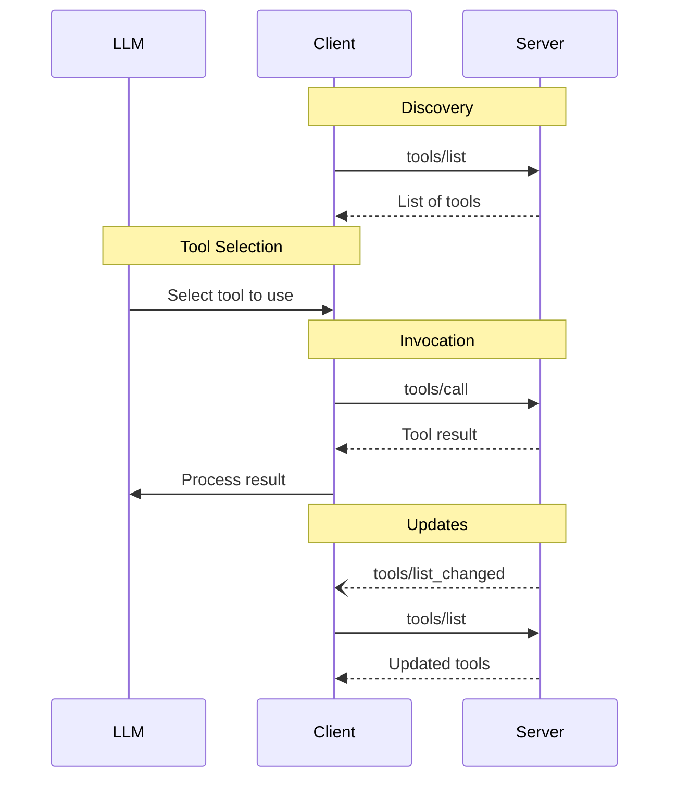

<div id="enable-section-numbers" />

<Info>**Protocol Revision**: 2025-06-18</Info>

モデルコンテキストプロトコル（MCP）は、サーバーが言語モデルから呼び出せるツールを公開することを可能にします。
ツールは、モデルが外部システムと対話することを可能にし、データベースへのクエリ、APIの呼び出し、計算の実行などを可能にします。
各ツールは名前で一意に識別され、そのスキーマを記述するメタデータを含んでいます。

## ユーザーインタラクションモデル

MCP のツールは **モデル制御** されるように設計されています。つまり、言語モデルはコンテキストの理解とユーザーの指示に基づいてツールを自動的に検出し、呼び出すことができます。

ただし、実装はニーズに合った任意のインターフェースパターンを通じてツールを公開できます。プロトコル自体は特定のユーザーインタラクションモデルを必須としていません。

<Warning>

信頼性、安全性、そしてセキュリティを確保するため、ツールの呼び出しを拒否できる人間が常に関与することが望ましいです。

アプリケーションは以下を行うべきです。

- AIモデルに公開されているツールを明確に示すUIを提供する
- ツールが呼び出された際に、明確な視覚的インジケーターを表示する
- 操作に関する確認プロンプトをユーザーに提示し、人間が関与していることを保証する

</Warning>

## 機能

ツールをサポートするサーバーは、`tools` 機能を宣言する必要があります。

```json
{
  "capabilities": {
    "tools": {
      "listChanged": true
    }
  }
}
```

`listChanged` は、使用可能なツールのリストが変更されたときにサーバーが通知を送信するかどうかを示します。

## プロトコルメッセージ

### ツールの一覧表示

利用可能なツールを見つけるために、クライアントは `tools/list` リクエストを送信します。この操作は [ページネーション](/specification/2025-06-18/server/utilities/pagination) をサポートしています。

**リクエスト:**

```json
{
  "jsonrpc": "2.0",
  "id": 1,
  "method": "tools/list",
  "params": {
    "cursor": "optional-cursor-value"
  }
}
```

**レスポンス:**

```json
{
  "jsonrpc": "2.0",
  "id": 1,
  "result": {
    "tools": [
      {
        "name": "get_weather",
        "title": "Weather Information Provider",
        "description": "Get current weather information for a location",
        "inputSchema": {
          "type": "object",
          "properties": {
            "location": {
              "type": "string",
              "description": "City name or zip code"
            }
          },
          "required": ["location"]
        }
      }
    ],
    "nextCursor": "next-page-cursor"
  }
}
```

### ツールの呼び出し

ツールを呼び出すには、クライアントは `tools/call` リクエストを送信します。

**リクエスト:**

```json
{
  "jsonrpc": "2.0",
  "id": 2,
  "method": "tools/call",
  "params": {
    "name": "get_weather",
    "arguments": {
      "location": "New York"
    }
  }
}
```

**レスポンス:**

```json
{
  "jsonrpc": "2.0",
  "id": 2,
  "result": {
    "content": [
      {
        "type": "text",
        "text": "Current weather in New York:\nTemperature: 72°F\nConditions: Partly cloudy"
      }
    ],
    "isError": false
  }
}
```

### リスト変更通知

利用可能なツールのリストが変更された場合、`listChanged` 機能を宣言したサーバーは**通知を送信すべき**です。

```json
{
  "jsonrpc": "2.0",
  "method": "notifications/tools/list_changed"
}
```

## メッセージフロー



## データ型

### ツール

ツール定義には以下が含まれます。

- `name`: ツールの一意の識別子
- `title`: 表示用に人間が判読できるツール名（オプション）
- `description`: 人間が判読できる機能の説明
- `inputSchema`: 想定されるパラメータを定義するJSONスキーマ
- `outputSchema`: 想定される出力構造を定義するJSONスキーマ（オプション）
- `annotations`: ツールの動作を記述するプロパティ（オプション）

<Warning>

信頼性と安全性、セキュリティを確保するため、クライアントは、信頼できるサーバーからのものでない限り、ツール注釈を信頼できないものと見なす必要があります。

</Warning>

### ツールの結果

ツールの結果には、[**構造化**](#structured-content) または **非構造化** コンテンツが含まれる場合があります。

**非構造化** コンテンツは結果の `content` フィールドに返され、異なるタイプの複数のコンテンツ項目が含まれる場合があります。

<Note>
  すべてのコンテンツタイプ（テキスト、画像、音声、リソースリンク、埋め込みリソース）は、対象ユーザー、優先度、変更時刻に関するメタデータを提供するオプションの[アノテーション](/specification/2025-06-18/server/resources#annotations)をサポートしています。
  これは、リソースやプロンプトで使用されるアノテーション形式と同じです。
</Note>

#### Text Content

```json
{
  "type": "text",
  "text": "Tool result text"
}
```

#### Image Content

```json
{
  "type": "image",
  "data": "base64-encoded-data",
  "mimeType": "image/png"
  "annotations": {
    "audience": ["user"],
    "priority": 0.9
  }

}
```

この例では、オプションの注釈の使用方法を示します。

#### Audio Content

```json
{
  "type": "audio",
  "data": "base64-encoded-audio-data",
  "mimeType": "audio/wav"
}
```

#### リソースリンク

ツールは、追加のコンテキストやデータを提供するために、[リソース](/specification/2025-06-18/server/resources)へのリンクを返すことが**可能です**。
この場合、ツールはクライアントがサブスクライブまたは取得できるURIを返します。

```json
{
  "type": "resource_link",
  "uri": "file:///project/src/main.rs",
  "name": "main.rs",
  "description": "Primary application entry point",
  "mimeType": "text/x-rust",
  "annotations": {
    "audience": ["assistant"],
    "priority": 0.9
  }
}
```

リソース リンクは、クライアントがリソースの使用方法を理解できるように、通常のリソースと同じ [リソース アノテーション](/specification/2025-06-18/server/resources#annotations) をサポートしています。

<Info>
  ツールによって返されるリソース リンクが `resources/list` リクエストの結果に表示されることは保証されません。
</Info>

#### 埋め込みリソース

[リソース](/specification/2025-06-18/server/resources) は、適切な [URI スキーム](./resources#common-uri-schemes) を使用して、追加のコンテキストやデータを提供するために埋め込まれることが**可能です**。
埋め込みリソースを使用するサーバーは、`resources` 機能を実装する必要があります**。

```json
{
  "type": "resource",
  "resource": {
    "uri": "file:///project/src/main.rs",
    "title": "Project Rust Main File",
    "mimeType": "text/x-rust",
    "text": "fn main() {\n    println!(\"Hello world!\");\n}",
    "annotations": {
      "audience": ["user", "assistant"],
      "priority": 0.7,
      "lastModified": "2025-05-03T14:30:00Z"
    }
  }
}
```

埋め込みリソースは、クライアントがリソースの使用方法を理解できるように、通常のリソースと同じ[リソース アノテーション](/specification/2025-06-18/server/resources#annotations)をサポートしています。

#### 構造化コンテンツ

**構造化**コンテンツは、結果の`structuredContent`フィールドにJSONオブジェクトとして返されます。

下位互換性のため、構造化コンテンツを返すツールは、TextContentブロックにシリアル化されたJSONも返す必要があります。

#### 出力スキーマ

ツールは、構造化された結果の検証用に出力スキーマを提供する場合もあります。
出力スキーマが提供される場合：

- サーバーは、このスキーマに準拠した構造化された結果を提供しなければなりません（MUST）。
- クライアントは、このスキーマに基づいて構造化された結果を検証すべきです（SHOULD）。

出力スキーマを含むツールの例：

```json
{
  "name": "get_weather_data",
  "title": "Weather Data Retriever",
  "description": "Get current weather data for a location",
  "inputSchema": {
    "type": "object",
    "properties": {
      "location": {
        "type": "string",
        "description": "City name or zip code"
      }
    },
    "required": ["location"]
  },
  "outputSchema": {
    "type": "object",
    "properties": {
      "temperature": {
        "type": "number",
        "description": "Temperature in celsius"
      },
      "conditions": {
        "type": "string",
        "description": "Weather conditions description"
      },
      "humidity": {
        "type": "number",
        "description": "Humidity percentage"
      }
    },
    "required": ["temperature", "conditions", "humidity"]
  }
}
```

このツールの有効な応答の例:

```json
{
  "jsonrpc": "2.0",
  "id": 5,
  "result": {
    "content": [
      {
        "type": "text",
        "text": "{\"temperature\": 22.5, \"conditions\": \"Partly cloudy\", \"humidity\": 65}"
      }
    ],
    "structuredContent": {
      "temperature": 22.5,
      "conditions": "Partly cloudy",
      "humidity": 65
    }
  }
}
```

出力スキーマを提供することで、クライアントとLLMは構造化されたツール出力を理解し、適切に処理できるようになります。具体的には、以下のようになります。

- レスポンスの厳密なスキーマ検証が可能
- プログラミング言語との統合性を高めるための型情報の提供
- クライアントとLLMが返されたデータを適切に解析・活用できるように支援
- ドキュメントと開発者エクスペリエンスの向上をサポート

## エラー処理

ツールは2つのエラー報告メカニズムを使用します。

1. **プロトコルエラー**: 次のような問題に関する標準JSON-RPCエラー

- 不明なツール
- 無効な引数
- サーバーエラー

2. **ツール実行エラー**: ツールの結果に `isError: true` で報告されます。
- APIエラー
- 無効な入力データ
- ビジネスロジックエラー

プロトコルエラーの例:

```json
{
  "jsonrpc": "2.0",
  "id": 3,
  "error": {
    "code": -32602,
    "message": "Unknown tool: invalid_tool_name"
  }
}
```

ツール実行エラーの例:

```json
{
  "jsonrpc": "2.0",
  "id": 4,
  "result": {
    "content": [
      {
        "type": "text",
        "text": "Failed to fetch weather data: API rate limit exceeded"
      }
    ],
    "isError": true
  }
}
```

## セキュリティに関する考慮事項

1. サーバーは**必須**です。

  - すべてのツール入力を検証する
  - 適切なアクセス制御を実装する
  - ツールの呼び出しレートを制限する
  - ツールの出力をサニタイズする

2. クライアントは**推奨**です。

  - 機密性の高い操作についてはユーザーに確認を求める
  - 悪意のある、または偶発的なデータ漏洩を防ぐため、サーバーを呼び出す前にツール入力をユーザーに表示する
  - LLMに渡す前にツールの結果を検証する
  - ツール呼び出しにタイムアウトを実装する
  - 監査のためにツールの使用状況を記録する
