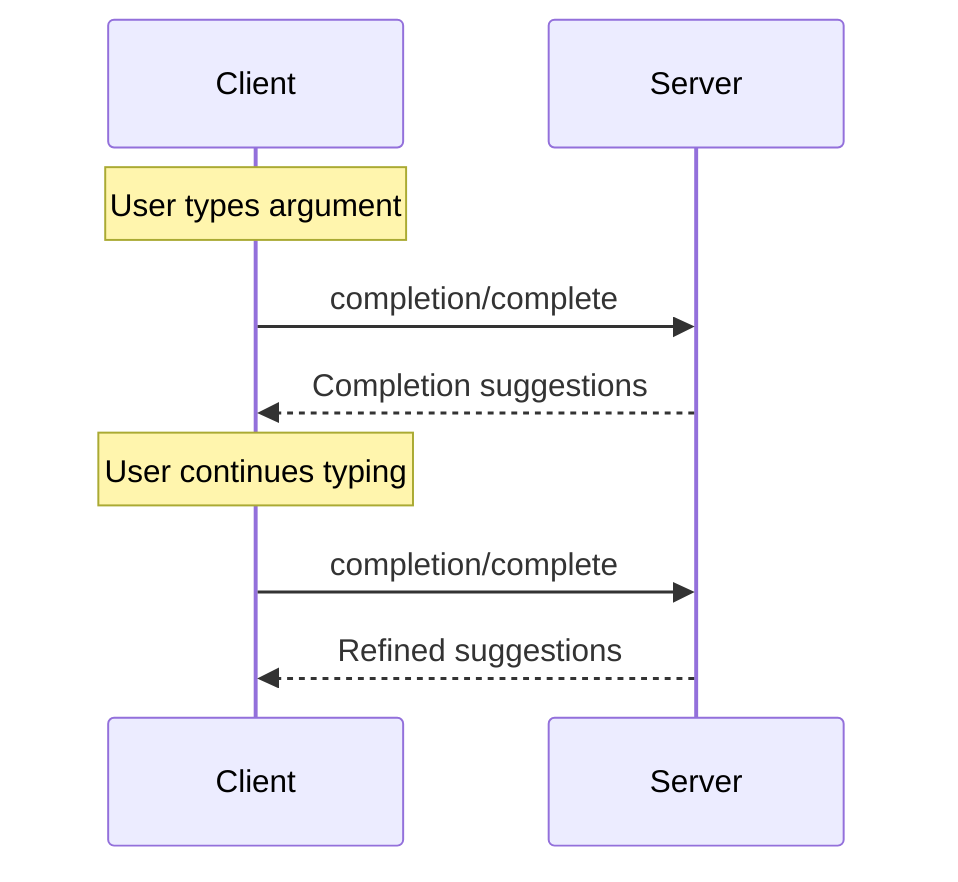

<div id="enable-section-numbers" />

<Info>**Protocol Revision**: 2025-06-18</Info>

モデルコンテキストプロトコル（MCP）は、プロンプトやリソースURIの引数の自動補完候補をサーバーが提供できる標準化された方法を提供します。これにより、ユーザーが引数値を入力する際にコンテキストに応じた候補が表示される、IDEのようなリッチなエクスペリエンスが実現します。

## ユーザーインタラクションモデル

MCP の補完機能は、IDE のコード補完と同様のインタラクティブなユーザーエクスペリエンスをサポートするように設計されています。

例えば、アプリケーションは、ユーザーが入力する際にドロップダウンメニューやポップアップメニューに補完候補を表示し、利用可能なオプションをフィルタリングして選択できるようにします。

ただし、実装はニーズに合った任意のインターフェースパターンを通じて補完機能を自由に公開できます。プロトコル自体は特定のユーザーインタラクションモデルを必須としていません。

## 機能

補完をサポートするサーバーは、`completions` 機能を宣言する必要があります。

```json
{
  "capabilities": {
    "completions": {}
  }
}
```

## プロトコルメッセージ

### 補完のリクエスト

補完候補を取得するために、クライアントは参照型を使用して補完対象を指定する `completion/complete` リクエストを送信します。

**リクエスト:**

```json
{
  "jsonrpc": "2.0",
  "id": 1,
  "method": "completion/complete",
  "params": {
    "ref": {
      "type": "ref/prompt",
      "name": "code_review"
    },
    "argument": {
      "name": "language",
      "value": "py"
    }
  }
}
```

**レスポンス:**

```json
{
  "jsonrpc": "2.0",
  "id": 1,
  "result": {
    "completion": {
      "values": ["python", "pytorch", "pyside"],
      "total": 10,
      "hasMore": true
    }
  }
}
```

複数の引数を持つプロンプトまたは URI テンプレートの場合、クライアントは、後続のリクエストにコンテキストを提供するために、以前の補完結果を `context.arguments` オブジェクトに含める必要があります。

**リクエスト:**

```json
{
  "jsonrpc": "2.0",
  "id": 1,
  "method": "completion/complete",
  "params": {
    "ref": {
      "type": "ref/prompt",
      "name": "code_review"
    },
    "argument": {
      "name": "framework",
      "value": "fla"
    },
    "context": {
      "arguments": {
        "language": "python"
      }
    }
  }
}
```

**レスポンス:**

```json
{
  "jsonrpc": "2.0",
  "id": 1,
  "result": {
    "completion": {
      "values": ["flask"],
      "total": 1,
      "hasMore": false
    }
  }
}
```

### 参照タイプ

このプロトコルは、2種類の補完参照をサポートしています。

| Type           | Description                 | Example                                             |
| -------------- | --------------------------- | --------------------------------------------------- |
| `ref/prompt`   | 名前でプロンプトを参照します | `{"type": "ref/prompt", "name": "code_review"}`     |
| `ref/resource` | リソースURIを参照します   | `{"type": "ref/resource", "uri": "file:///{path}"}` |

### 補完結果

サーバーは、関連性に基づいてランク付けされた補完値の配列を返します。配列の内容は以下のとおりです。

- 応答ごとに最大100件
- 利用可能な一致項目の総数（オプション）
- 追加の結果が存在するかどうかを示すブール値

## メッセージフロー



## データ型

### CompleteRequest

- `ref`: `PromptReference` または `ResourceReference`
- `argument`: 以下の要素を含むオブジェクト:
  - `name`: 引数名
  - `value`: 現在の値
- `context`: 以下の要素を含むオブジェクト:
  - `arguments`: 解決済みの引数名とその値のマッピング。

### CompleteResult

- `completion`: 以下の内容を含むオブジェクト:
  - `values`: 候補の配列 (最大 100 件)
  - `total`: 一致した候補の総数 (オプション)
  - `hasMore`: 追加結果フラグ

## エラー処理

サーバーは、一般的な失敗ケースに対して標準のJSON-RPCエラーを返す必要があります（**SHOULD**）。

- メソッドが見つからない: `-32601` (機能がサポートされていません)
- プロンプト名が無効: `-32602` (無効なパラメータ)
- 必須の引数がない: `-32602` (無効なパラメータ)
- 内部エラー: `-32603` (内部エラー)

## 実装に関する考慮事項

1. サーバーは**すべき**:

  - 関連性でソートされた候補を返す
  - 適切な場合はあいまい一致を実装する
  - 補完リクエストのレート制限を行う
  - すべての入力を検証する

2. クライアントは**すべき**:

  - 高速補完リクエストをデバウンスする
  - 適切な場合は補完結果をキャッシュする
  - 欠落または部分的な結果を適切に処理する

## セキュリティ

実装は**必須**です:

- すべての補完入力を検証する
- 適切なレート制限を実装する
- 機密性の高い提案へのアクセスを制御する
- 補完に基づく情報漏洩を防止する