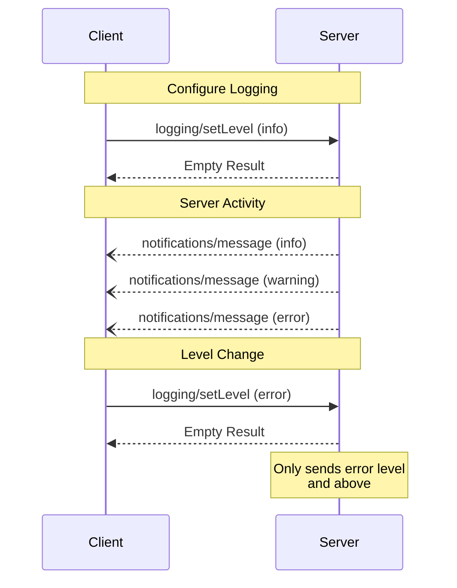

<div id="enable-section-numbers" />

<Info>**Protocol Revision**: 2025-06-18</Info>

モデルコンテキストプロトコル（MCP）は、サーバーがクライアントに構造化されたログメッセージを送信するための標準化された方法を提供します。
クライアントは最小ログレベルを設定することでログの詳細度を制御でき、サーバーは重大度レベル、オプションのロガー名、および任意のJSONシリアル化可能なデータを含む通知を送信します。

## ユーザーインタラクションモデル

実装は、ニーズに合った任意のインターフェースパターンを通じてログ記録を自由に公開できます。プロトコル自体は、特定のユーザーインタラクションモデルを必須としていません。

## 機能

ログメッセージ通知を発行するサーバーは、`logging` 機能を宣言する必要があります。

```json
{
  "capabilities": {
    "logging": {}
  }
}
```

## ログレベル

このプロトコルは、[RFC 5424](https://datatracker.ietf.org/doc/html/rfc5424#section-6.2.1) で規定されている標準的な Syslog の重大度レベルに準拠しています。

| レベル | 説明 | 使用例 |
| --------- | -------------------------------- | -------------------------- |
| debug | 詳細なデバッグ情報 | 関数のエントリ/終了ポイント |
| info | 一般的な情報メッセージ | 操作の進行状況の更新 |
| notification | 正常だが重要なイベント | 構成の変更 |
| warning | 警告状態 | 非推奨の機能の使用 |
| error | エラー状態 | 操作の失敗 |
| critical | 重大な状態 | システム コンポーネントの障害 |
| alert | すぐに対処する必要があります | データ破損が検出されました |
| emergency | システムが使用できません | 完全なシステム障害 |

## プロトコルメッセージ

### ログレベルの設定

最小ログレベルを設定するために、クライアントは `logging/setLevel` リクエストを送信できます。

**リクエスト:**

```json
{
  "jsonrpc": "2.0",
  "id": 1,
  "method": "logging/setLevel",
  "params": {
    "level": "info"
  }
}
```

### ログメッセージ通知

サーバーは `notifications/message` 通知を使用してログメッセージを送信します。

```json
{
  "jsonrpc": "2.0",
  "method": "notifications/message",
  "params": {
    "level": "error",
    "logger": "database",
    "data": {
      "error": "Connection failed",
      "details": {
        "host": "localhost",
        "port": 5432
      }
    }
  }
}
```

## メッセージフロー



## エラー処理

サーバーは、一般的な失敗ケースに対して標準のJSON-RPCエラーを返す必要があります（**SHOULD**）。

- 無効なログレベル: `-32602` (無効なパラメータ)
- 設定エラー: `-32603` (内部エラー)

## 実装に関する考慮事項

1. サーバーは**すべき**です:

  - ログメッセージのレート制限
  - データフィールドに関連コンテキストを含める
  - 一貫したロガー名を使用する
  - 機密情報を削除する

2. クライアントは**しても良い**です:

  - UI にログメッセージを表示する
  - ログのフィルタリング/検索を実装する
  - 重大度を視覚的に表示する
  - ログメッセージを永続化する

## セキュリティ

1. ログメッセージには**含めてはなりません**:

  - 認証情報またはシークレット
  - 個人を特定できる情報
  - 攻撃を助長する可能性のある内部システムの詳細

2. 実装は**すべき**です:

  - メッセージのレート制限
  - すべてのデータフィールドを検証する
  - ログアクセスを制御する
  - 機密コンテンツを監視する
