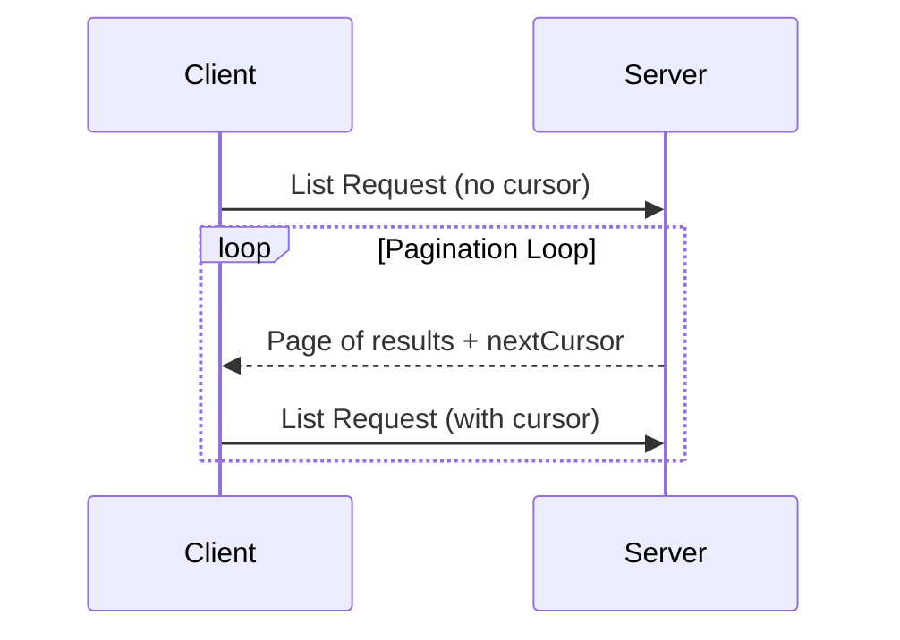

<div id="enable-section-numbers" />

<Info>**Protocol Revision**: 2025-06-18</Info>

モデルコンテキストプロトコル（MCP）は、大規模な結果セットを返す可能性のあるリスト操作のページ分割をサポートします。
ページ分割により、サーバーは結果を一度にではなく、小さなチャンクで生成できます。

ページ分割は、インターネット経由で外部サービスに接続する場合に特に重要ですが、大規模なデータセットによるパフォーマンスの問題を回避するためにローカル統合にも役立ちます。

## ページネーションモデル

MCP のページネーションは、番号付きページではなく、カーソルベースの不透明なアプローチを採用しています。

- **カーソル** は、結果セット内の位置を表す不透明な文字列トークンです。
- **ページサイズ** はサーバーによって決定され、クライアントは固定ページサイズを想定してはなりません。**してはなりません**。

## レスポンス形式

ページネーションは、サーバーが以下の情報を含む**レスポンス**を送信した時点で開始されます。

- 現在の結果ページ
- 結果がさらに存在する場合のオプションの`nextCursor`フィールド

```json
{
  "jsonrpc": "2.0",
  "id": "123",
  "result": {
    "resources": [...],
    "nextCursor": "eyJwYWdlIjogM30="
  }
}
```

## リクエスト形式

カーソルを受け取った後、クライアントはそのカーソルを含むリクエストを発行することでページングを続行できます。

```json
{
  "jsonrpc": "2.0",
  "method": "resources/list",
  "params": {
    "cursor": "eyJwYWdlIjogMn0="
  }
}
```

## ページネーションフロー



## ページネーションをサポートする操作

以下の MCP 操作はページネーションをサポートします。

- `resources/list` - 利用可能なリソースの一覧表示
- `resources/templates/list` - リソーステンプレートの一覧表示
- `prompts/list` - 利用可能なプロンプトの一覧表示
- `tools/list` - 利用可能なツールの一覧表示

## 実装ガイドライン

1. サーバーは**すべき**です。

  - 安定したカーソルを提供する
  - 無効なカーソルを適切に処理する

2. クライアントは**すべき**です。

  - `nextCursor` が見つからない場合は、結果の終了として扱う
  - ページネーション付きフローとページネーションなしフローの両方をサポートする

3. クライアントはカーソルを不透明なトークンとして**扱わなければならない**です。

  - カーソルの形式を仮定しない
  - カーソルの解析や変更を試みない
  - セッション間でカーソルを保持しない

## エラー処理

無効なカーソルは、コードエラーとなる**べき**です。 -32602 (無効なパラメータ)。